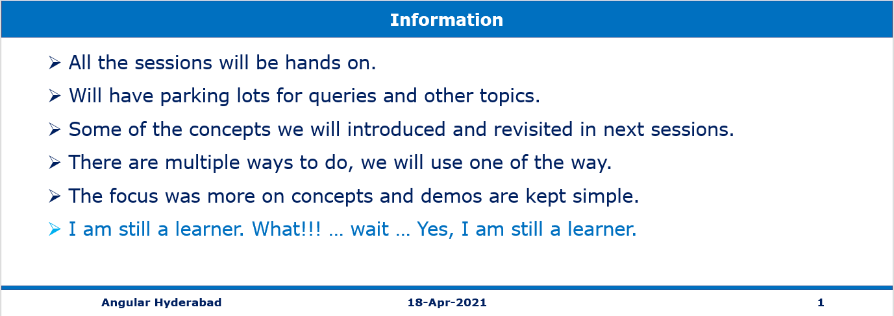
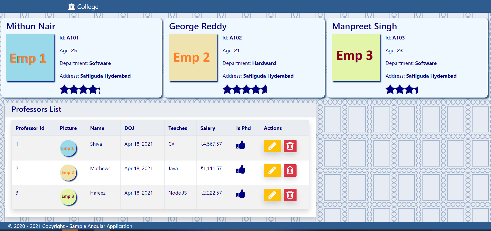

# Session **4 of 12** - Components Communication in Angular 11 for Beginners

> 1. Event Date: **17-Apr-2021**
> 1. Event URL: [Angular Hyderabad](https://www.meetup.com/nghyderabad/events/277581695/)

----------------------------------------------------------------------------------------------------------------

## Pre-Requisites

### Software/Tools
> 1. OS: win32 x64
> 1. Angular CLI: **11.2.7**
> 1. Node: **14.16.0**
> 1. Visual Studio Code

### Prior Knowledge
> 1. Html, CSS
> 1. Type Script
> 1. Java Script
> 1. Basic Angular

### Assumptions
> 1. NIL

## Technology Stack
> 1. Single Page Application using Angular 11

## Upgrade the Angular Cli/Core
```
ng update @angular/cli @angular/core
```

## Information


## UI Look and Feel

### Previous Session's UI **(Session 3)**


### Current Session's UI **(Session 4)**


----------------------------------------------------------------------------------------------------------------

## What are we doing today?
> 1. View the Session 3rd's deployed Web App in Firebase
> 1. Clean up the previous session's code
> 1. Creating footer component
>    - ([Property]='Method1()'] & with String Intropolation {{method1()}}
> 1. Creating Star Rating Component
>    - overflow: hidden | scroll
> 1. Property Binding Re-Visited  
>    - ([src]='object.property' VS [src]="'StringValue'") 
> 1. Sharing data between child and parent directives and components 
>    - @Input 
>    - @Output 
> 1. Life cycle Hooks 
>    - NgOnInit 
>    - NgOnChange 
> 1. Card Representation and Parent Child Components
> 1. Table Representation
> 1. Deploying Angular 11 application to Firebase

----------------------------------------------------------------------------------------------------------------

## How to Build and Execute the solution

### **1. View the Session 3's deployed Web App in Firebase**
Demo

### **2. Clean up the previous session's code**

> 1. Move Employee, Login, Professorv3 into **ToBeDeleted** folder.
> 1. Create a folder called **shared** and move the top-navbar into it.
> 1. Clean up the app.module.ts and app.component.html.


### **3. Creating footer component**

> 1. Execute the "ng generate" command to create the **footer** component.
> 1. Discussion on invoking method with String Intropolation.
> 1. Discussion on invoking method from Property binding ([Property]='Method1()'].
> 1. Please refer the "shared/footer" folder under **StarterFiles**.

```
ng g c components/shared/footer
```

### **4. Creating Star Rating Component**

> 1. Execute the "ng generate" command to create the **rating** component.
> 1. overflow: hidden | scroll.

```
ng g c components/shared/rating
```

### **5. Property Binding Re-Visited**
> 1. Discussion on Property Binding

```
([src]='object.property' VS [src]="'StringValue'")
```

### **6. Sharing data between child and parent components**
> 1. @Input
> 1. @Output


### **7. Life cycle Hooks**
> 1. NgOnInit.
> 1. NgOnChange.


### **8. Card Representation and Parent Child Components**

> 1. Execute the "ng generate" command to create the **employees-list** component.

```
ng g c components/employees/employees-list
```

### **9. Table Representation**

> 1. Execute the "ng generate" command to create the **professors-list** component.

```
ng g c components/professors/professors-list
```

### **11. Deploying Angular 11 application to Firebase**
> 1. Create a new project in FireBase.
> 1. Create a Hosting 
> 1. Create Cloud Firestore

**Ensure that you are specifying "dist/collegewebapp" as public folder**
```
npm install -g firebase-tools
ng build --prod
firebase login
ng add @angular/fire
firebase init
firebase deploy --only hosting:ng11-webapp (ng11-webapp === Firebase Project Name)
```

----------------------------------------------------------------------------------------------------------------

