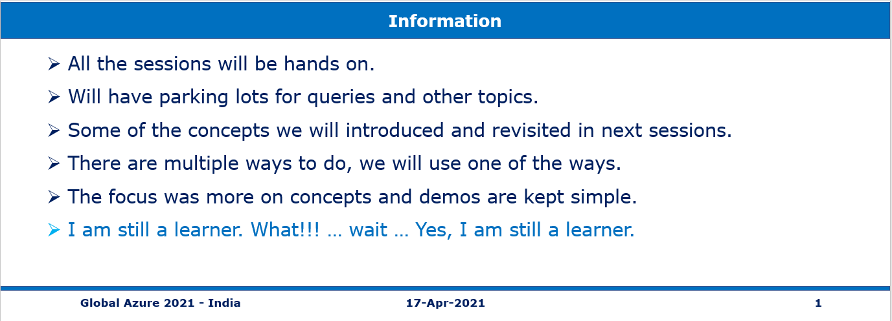

# Repository for Speaking Event of Global Azure 2021 - India 

> 1. Event Date: **17-Apr-2021**
> 1. Event URL: [Global Azure 2021 - India](https://gab2021.azurewebsites.net/)


----------------------------------------------------------------------------------------------------------------

## Pre-Requisites

### Software/Tools
> 1. OS: win32 x64
> 1. Angular CLI: **11.2.7**
> 1. Node: **14.16.0**
> 1. Visual Studio Code

### Prior Knowledge
> 1. To be Done
> 1. To be Done
> 1. To be Done
> 1. To be Done

### Assumptions
> 1. NIL

## Technology Stack
> 1. Azure Functions

## Information


## UI Look and Feel

### Few Pictures UI 


----------------------------------------------------------------------------------------------------------------

## What are we doing today?
> 1. Introduction to Azure Functions
> 1. Creating Azure Functions in C#, and Node JS
> 1. Creating Azure Functions using multiple methods
> 1. Execute Azure Functions with triggers [Http, Timer, and Blob]
> 1. Execute Azure Functions with input/output bindings
> 1. Working with Durable Azure Functions
> 1. Monitoring Azure Functions with Application Insights
> 1. Deploying Azure Functions using Azure CLI
----------------------------------------------------------------------------------------------------------------


----------------------------------------------------------------------------------------------------------------

```
rg-globalaz2021-india-dev-001
rg-globalaz2021-india-prod-001
```

## How to Build and Execute the solution

### **1. Introduction to Azure Functions**
Discussion

### **2. Creating Azure Functions in C#, and Node JS**
Discussion

### **2. Creating Azure Functions using multiple methods**
We will be creating Azure Functions using A. Portal, B. Azure Functions Core Tools, C. Visual Studio Code, and D. Visual Studio

#### **2.1. Portal using Node JS**
Demo

#### **B. Azure Functions Core Tools using Node JS**
Demo

#### **C. Visual Studio Code using Node JS**
Demo

#### **D. Visual Studio using C#**
Demo

#### **Testing Azure Functions using Postman**
Demo

### **1. Execute Azure Functions with triggers [Http, Timer, and Blob]**
Demo

### **1. Execute Azure Functions with input/output bindings**
Demo

### **1. Monitoring Azure Functions with Application Insights**
Demo

### **1. Deploying Azure Functions using Azure CLI**
Demo
