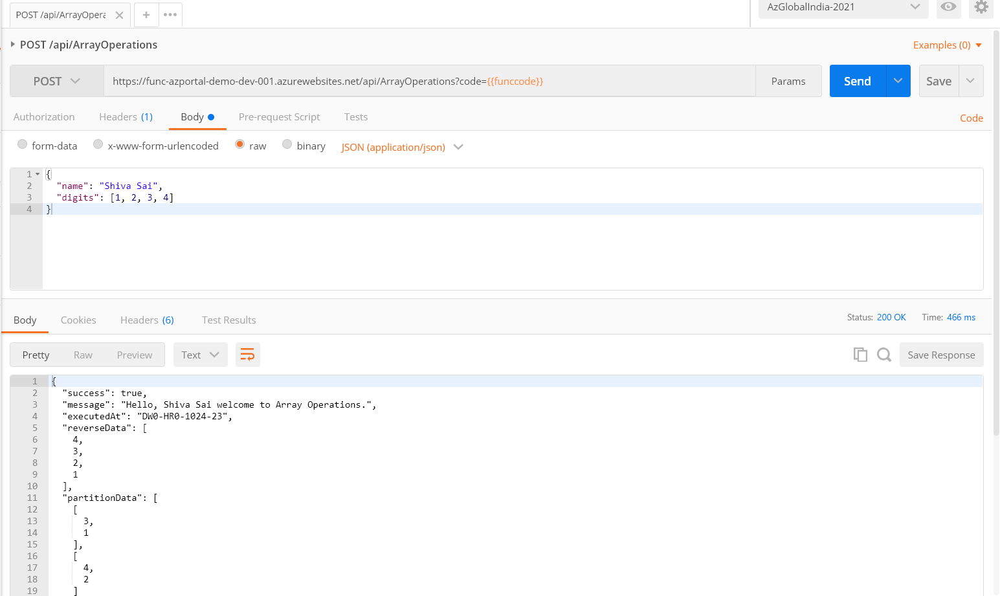

# Repository for Speaking Event of Global Azure 2021 - India 

> 1. Event Date: **17-Apr-2021**
> 1. Event URL: [Global Azure 2021 - India](https://gab2021.azurewebsites.net/)


----------------------------------------------------------------------------------------------------------------

## Pre-Requisites
> 1. .NET SDK
> 1. Azure Function Core Tools
> 1. Azure CLI
> 1. Azure Functions VS Code Extension

### Software/Tools
> 1. OS: win32 x64
> 1. Angular CLI: **11.2.7**
> 1. Node: **14.16.0**
> 1. Visual Studio Code
> 1. Visual Studio 2019

### Prior Knowledge
> 1. C#, Node JS
> 1. gRPC
> 1. Azure
> 1. Blazor WASM, Angular 11

### Assumptions
> 1. NIL

## Technology Stack
> 1. Azure Functions

## Information


----------------------------------------------------------------------------------------------------------------

## What are we doing today?
> 1. Introduction to Azure Functions
> 1. Creating Azure Functions in C#, and Node JS
> 1. Creating Azure Functions using multiple methods
> 1. Execute Azure Functions with triggers [Http, and Blob]
> 1. Execute Azure Functions with input/output bindings
> 1. Working with Durable Azure Functions
> 1. Monitoring Azure Functions with Application Insights
> 1. Deploying Azure Functions using Azure CLI
----------------------------------------------------------------------------------------------------------------


----------------------------------------------------------------------------------------------------------------

```
rg-globalaz2021-india-dev-001
cosmos-globalaz2021-india-dev-001
stglobalaz2021india001
func-azcoretools-demo-dev-001

func-vscode-demo-dev-001

stazcoretoolsdemo001
stvscodedemo001
stvs2019demo001
rg-globalaz2021-india-prod-001
```
- Storage Account
- Application Insights
- App Service Plan

## How to Build and Execute the solution

### **1. Introduction to Azure Functions**
Discussion

### **2. Creating Azure Functions in C#, and Node JS**
Discussion

### **2. Creating Azure Functions using multiple methods**
We will be creating Azure Functions using A. Portal, B. Azure Functions Core Tools, C. Visual Studio Code, and D. Visual Studio

#### **2.1. Portal using Node JS**
1. Create a Function App called "func-azportal-demo-dev-001"
1. Add a Function and code
1. Code and Test
1. Integration
1. Monitor
1. Storage Account Explorer
1. Kudu Console
1. Testing using Browser (GET)
1. Testing using Postman (POST)

##### **Images for Reference**
##### **Image 1**


##### **Image 2**


#### **B. Azure Functions Core Tools using Node JS**

1. Verify the Azure Functions Core Tools on local Laptop.
1. Create the Azure Function project using **func init**
1. Create a new function with **func new**
1. Verify functions locally **func start**
1. Function App is already create using **az functionapp create** command
1. Publish the Function app to Azure using **func azure functionapp publish func-azcoretools-demo-dev-001**
1. Ensure to update the Function App with Table Storage Connection String

```
func version
func
func init
func new
func start
func azure functionapp publish func-azcoretools-demo-dev-001
```

##### **Images for Reference**

##### **Image 1**


##### **Image 2**


##### **Image 3**


#### **C. Visual Studio Code using Node JS**
Demo

#### **D. Visual Studio using C#**
Demo

### **1. Execute Azure Functions with input/output bindings**
Demo

### **1. Monitoring Azure Functions with Application Insights**
Demo

### **1. Deploying Azure Functions using Azure CLI**
Demo
