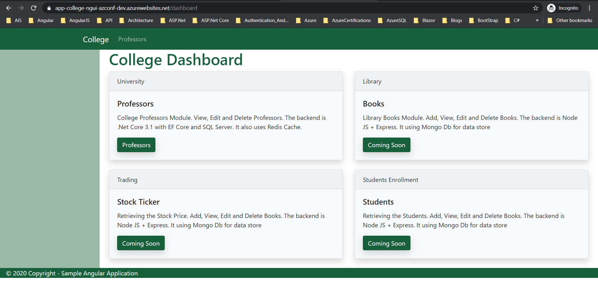
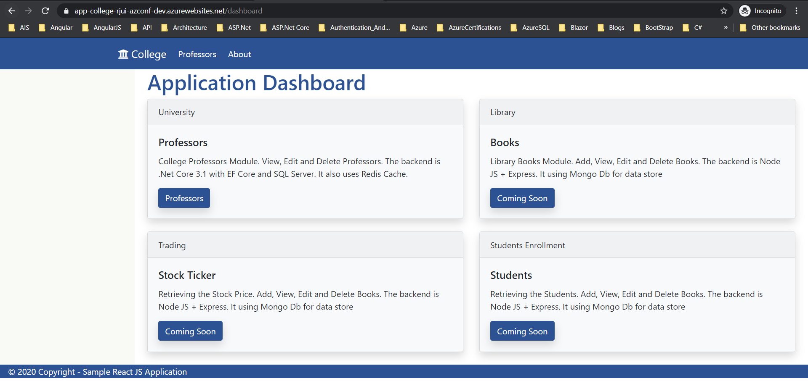

# Full Stack Session [https://www.azconf.dev](https://www.azconf.dev) 26-Nov-2020 at 10:00 AM IST

> ## SESSION WILL BE RECORDED AND SHARED WITH PARTICIPANTS.

## Demo of entire solution (**10 Minutes**)
> 1. Demo of entire solution on Local Laptop.
> 2. Demo of entire solution on Azure.

*****

## 1. Local & Azure SQL Server (**5 Minutes**)
> 1. Using Azure Data Studio
> 2. Making Firewall changes to access SQL Server.
> 3. Using SQL Scripts we will craete tables, and data population in SQL Azure.
> 4. SQL Scripts included for creating database, tables, and data population.

## 2. .Net Core Web API (**30 Minutes**)
> 1. Building Professor’s Controller
> 2. Executing in IIS Express & Kestrel. launchSettings.json
> 3. Implement GetAll() method.
> 4. User Secrets instead of appSettings.json
> 5. Dependency Injection
> 6. Layered Solution [Application Core, BLL, SQL DAL]
> 7. Add Application Insights
> 8. Deploy to Azure using Visual Studio.
> 9. Verify /WeatherForecast and /Professors from Chrome Browser.

## 3. Swagger UI (**7 Minutes**)
> 1. Adding Swagger UI to Web API
> 2. Testing API using Swagger on Chrome Browser
> 3. Deploy Web API Changes to Azure using Visual Studio.
> 4. Verify Swagger from Chrome Browser.

## 4. Postman Collection (**8 Minutes**)
> 1. Using Postman to verify the API
> 2. Postman Collection and its advantages.

*****
> BIO BREAK ONE (**8 Minutes**)
*****

## 5. Redis Cache (Cache Aside Pattern) (**20 Minutes**)
> 1. Including the Redis Cache into the mix.
> 2. Updating Layered Solution to include Redis Cache DAL.
> 3. Improving Data Retrieval Time.
> 4. Implementing the Cache Aside Pattern.
> 5. Deploy Web API Changes to Azure using Visual Studio.

## 6. Angular 10 (**30 Minutes**)
> 1. Creating the Angular 10 UI from Scratch
> 2. Creating Top Nav, Side Nav, Footer, and Dashboard.
> 3. Creating Screens for List, Add, Edit, Delete.
> 4. Adding Service to retrieve content from Web API
> 5. Routing to navigate between the pages.
> 6. Add Application Insights
> 7. Changing Skin colors and Production Build
> 8. Deploying Angular 10 UI to App Service in Azure

*****
> BIO BREAK TWO (**8 Minutes**)
*****

## 7. React JS (**30 Minutes**)
> 1. Creating the same UI using React JS
> 2. Integrating with Web API
> 3. Add Application Insights
> 4. Deploying Angular 10 UI to App Service in Azure

*****
> BIO BREAK THREE (**8 Minutes**)
*****

## 8. Blazor WASM UI (**20 Minutes**)
> 1. Integrating with Web API
> 2. Deploying Blazor WASM to Azure

## 9. Azure Application Insights (**10 Minutes**)
1. View Application Insights inside Azure Portal

## 10. SUMMARY / RECAP / Q&A (**10 Minutes**)
*****
> 1. SUMMARY / RECAP / Q&A 
> 2. Any open queries, I will get back through email.
*****