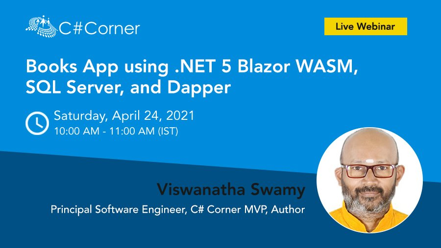
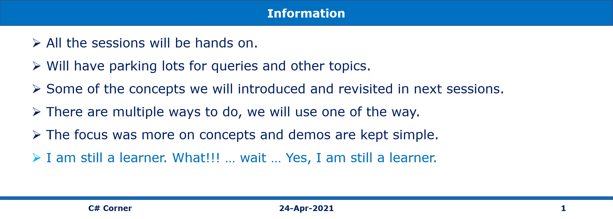
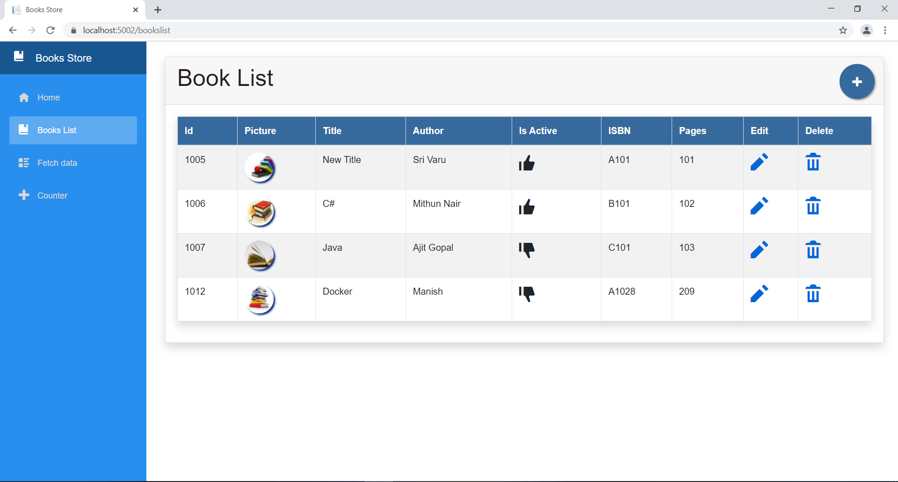
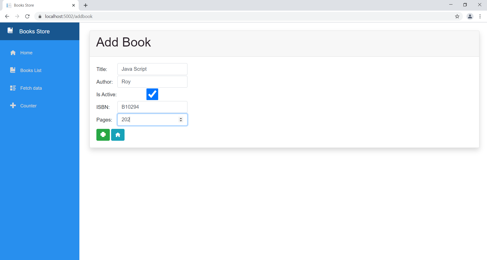

# Books App using .NET 5 Blazor WASM, SQL Server, and Dapper

> 1. Event Date: **24-Apr-2021**
> 1. Event URL: [C# Corner](https://www.c-sharpcorner.com/events/books-app-using-net-5-blazor-wasm-sql-server-and-dapper)

---

## Pre-Requisites

### Software/Tools
> 1. OS: win32 x64
> 1. SQL Server
> 1. .NET 5
> 1. Visual Studio Code
> 1. Visual Studio 2019

### Prior Knowledge
> 1. Html, CSS
> 1. C#, Async/Await
> 1. SQL Server Basics
> 1. Blazor Web Assembly Basics
> 1. Web App development Basics
> 1. Web API Basics

### Assumptions
> 1. NIL

## Technology Stack
> 1. Single Page Application using .NET 5 Blazor WASM, SQL Server, and Dapper

## Information

## UI Look and Feel

### Books List

### Add Book

---

## What are we doing today?
> 1. Create the SQL Project.
>    - Create Table
>    - Create Stored Procedures
>    - Deploy it to database
>    - Verify the Table, and Stored Procedures exists in Database
> 1. Create Web API using .Net 5, SQL Server, Dapper
>    - Create Books.Data for Data Objects.
>    - Create Books.API
>    - Create BookRepository, it used Dapper to interact with SQL Server
>    - Verify with Postman
> 1. Create Blazor Web Assembly Web Application
>    - Integrate with Web API
---

## How to Build and Execute the solution

### 1. Create the SQL Project.

- Create Table

- Create Stored Procedures

- Deploy it to database

- Verify the Table, and Stored Procedures exists in Database

### 2. Create Web API using .Net 5, SQL Server, Dapper

- Update the appsettings.json

- Create SettingsData.cs for reading the configuration from appsettings.json file

- Create IBookRepository.cs, and BookRepository.cs

- Create BooksController.cs and implement Add, GetAll, GetById

- Test it in Postman

### 3. Create Blazor Web Assembly Web Application

- Create appsettins.json into wwwroot folder
- Copy the images into wwwroot folder
- Update the app.css inside wwwroot folder
- Update the Layout (MainLayout.razor, MainLayout.razor.css)
- Update the Menu Options (NavMenu.razor)
- Modify the FetchData (FetchData.razor, FetchData.cs)
- Create **Services** folder (IBookDataService.cs, BookDataService.cs)
- Update the Program.cs to add IBookDataService.cs, and BookDataService.cs as dependencies.
- Create BooksList, AddBook, EditBook, and DeleteBook