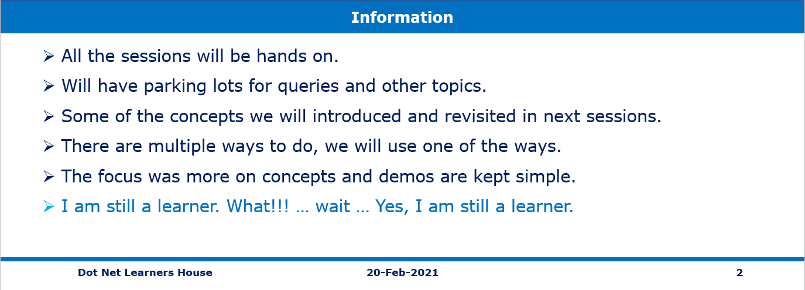
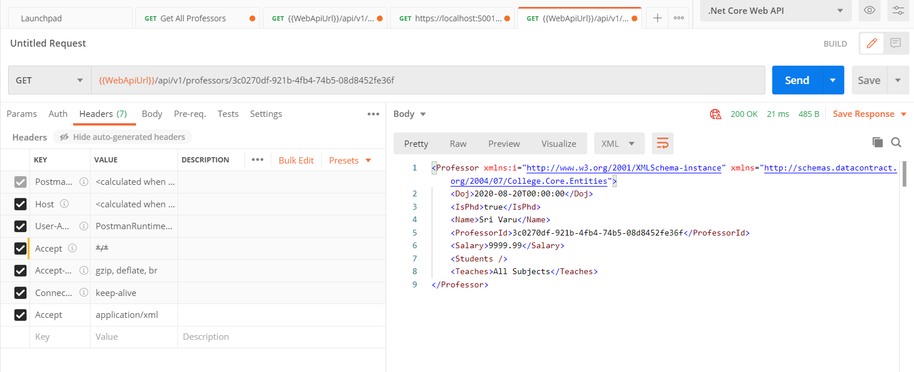
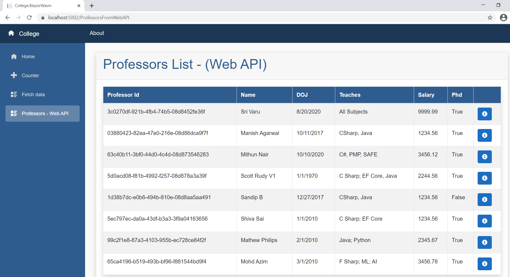

# Session 3 OF 15 (REST Web API using .Net 5, SQL Server)


## Pre-Requisites

### Software/Tools
> 1. .NET 5
> 1. VS 2019 Community Edition
> 1. Visual Studio Code
> 1. Postman
> 1. SQL Server 2016 and above 

### Knowledge
> 1. Basic C#
> 1. Basic EF Core
> 1. Basic knowledge of async/await

### Assumptions
> 1. Database is created and .sql scrips are ran.
> 1. Please refer to the ./Scripts Folder


## Technology Stack

> 1. .NET 5 SDK
> 1. Web API
> 1. Blazor WASM
> 1. Angular 11

## Information


## What we will be doing today
> 1. Action Return Types | Status Codes [200, 404, 406, 500]
> 1. Format Response data and content negotiation
> 1. Test web APIs with the HttpRepl
> 1. Retrieving Single Resource
> 1. Creating SQL Azure
> 1. Integrating Local Web API with Azure SQL.
> 1. Integrating Web API with Blazor WASM for GetById().
> 1. Integrating with Angular 11 App (already developed).

## How to Build and Execute the solution

### ReturnHttpNotAcceptable
> If the client tries to negotiate for the media type the server doesn’t support, it should return the 406 Not Acceptable status code.

```
services.AddControllers(options =>
            {
                options.ReturnHttpNotAcceptable = true;
            })
```
### Format response data
> Actions can return results that are formatted in a particular format, regardless of client preferences

```
[HttpGet("About")]
public ContentResult About()
{
    return Content("An API for getting Weather Forecast.");
}

[HttpGet("student")]
public ActionResult Student()
{
    var student = new { Id = 1, FirstName = "James", LastName = "Bond" };
    return Ok(student);
}
```

### Content Negotiation
> Content negotiation occurs when the client specifies an Accept header. The default format is JSON.

```
services.AddControllers(options =>
            {
                options.ReturnHttpNotAcceptable = true;
                options.RespectBrowserAcceptHeader = true;
            })
            .AddXmlDataContractSerializerFormatters();
```

### Test web APIs with the HttpRepl
> ```
> dotnet tool install -g Microsoft.dotnet-httprepl
> ```

```
httprepl https://localhost:5001
https://localhost:5001/> get api/v1/weatherforecast

https://localhost:5001/> set header accept application/xml
https://localhost:5001/> get api/v1/weatherforecast
```


### Retrieving Single Resource
> 1. Demo / Discussion

### Creating SQL Azure
> 1. Demo / Discussion

### Integrating Local Web API with Azure SQL.
> 1. Demo / Discussion

> 1. Integrating Web API with Blazor WASM for GetById().
> 1. Integrating with Angular 11 App (already developed).


### Building Professor’s Controller (Using Folders for seperation)
> 1. Modify ProfessorsController.cs to use the code from libraries.
> 1. Modify WeatherForecastController.cs to refer the WeatherForecast model.

### Introduction Action Return Types
> 1. Demo / Discussion

### Implement GetAll() method
> 1. Adding Dependencies inside **ConfigureServices()** method of Startup.cs.
> 1. Consume the Professors BLL from the library.
> 1. User Secrets instead of appSettings.json. 

### Verify the controllers using Swagger and Chrome Browser
> 1. Demo / Discussion


## Look and Feel


## Create a New Blazor WASM
> 1. Create a new Blazor WASM project (**College.BlazorWasm.csproj**)

## Modify Blazor UI
> 1. MainLayout.razor.css
> 1. MainLayout.razor
> 1. app.css

## Modify to add two more menu items
> 1. NavMenu.razor
> 1. NavMenu.razor.css

## REST API Integration
> 1. Also reference College.Core.
> 1. Create ProfessorsFromWebAPI.razor, and ProfessorsFromWebAPI.cs.


