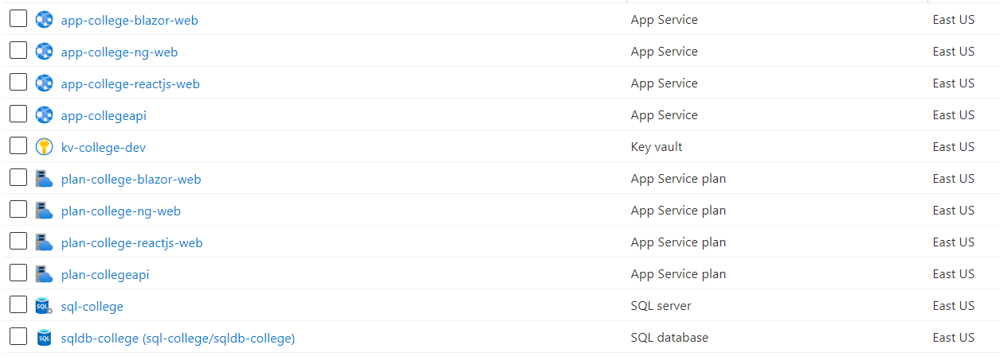
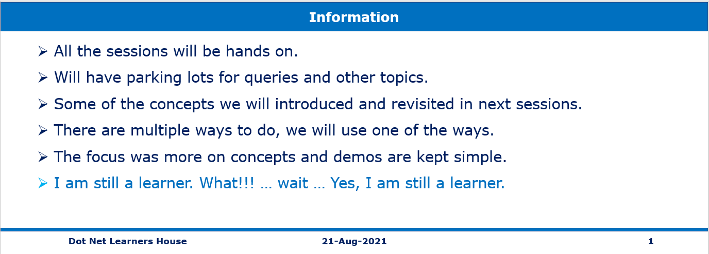

# Cloud Native Full Stack Session 21-Aug-2021 at 02:00 PM IST

## Event URL: [https://www.meetup.com/dot-net-learners-house-hyderabad/events/276122843/](https://www.meetup.com/dot-net-learners-house-hyderabad/events/276122843/) 

---

## Application Architecture Diagram 

---

## Resources in Azure

## Information

## What are we doing today?
> 1. Creating SQL tables in Azure SQL.
> 1. Storing the SQL Credentials inside the Key Vault.
> 1. Deploying Web API to App Server.
> 1. Configuring the Web API to use the credentials from Key Vault
> 1. Verifying Web API using Postman.
> 1. Deploying Blazor WASM, and integrating with Web API.

*****

## 1. Azure SQL Server
> 1. Using Azure Data Studio
> 1. Making Firewall changes to access SQL Server.
> 1. Using SQL Scripts we will create tables, and data population in SQL Azure.
> 1. SQL Scripts included for creating database, tables, and data population.

## 2. Azure Key Vault
> 1. Storing the SQL Database credentials inside the Azure Key Vault

## 3. .Net Core Web API
> 1. Building Professor’s Controller
> 1. Executing in IIS Express & Kestrel. launchSettings.json
> 1. Implement GetAll() method.
> 1. User Secrets instead of appSettings.json
> 1. Verify /Professors from Chrome Browser.

## 4. Swagger UI
> 1. Testing API using Swagger on Chrome Browser
> 1. Deploy Web API Changes to Azure using Visual Studio.

## 5. Azure Key Vault
> 1. Configuring the Web API to use the credentials from Key Vault

## 6. Postman Collection
> 1. Using Postman to verify the API
> 2. Postman Collection and its advantages.

*****
> BIO BREAK ONE (**10 Minutes**)
*****

## 7. Blazor WASM UI
> 1. Integrating with Web API
> 2. Deploying Blazor WASM to Azure

## 8. SUMMARY / RECAP / Q&A 

*****
> 1. SUMMARY / RECAP / Q&A 
> 2. Any open queries, I will get back through meetup chat/twitter.
*****