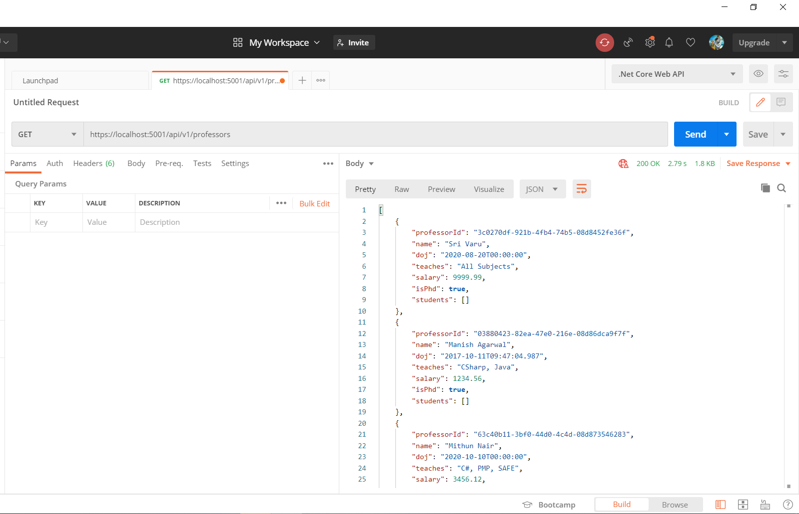

# Session 1 OF 15 (REST Web API using .Net 5, SQL Server)

## Pre-Requisites

### Software/Tools
> 1. .NET 5
> 1. VS 2019 Community Edition
> 1. Visual Studio Code
> 1. Postman
> 1. SQL Server 2016 and above 

### Knowledge
> 1. Basic C#
> 1. Basic EF Core
> 1. Basic knowledge of async/await

### Assumptions
> 1. Database is created and .sql scrips are ran.
> 1. Please refer to the ./Scripts Folder

## Technology Stack

> 1. .NET 5 SDK
> 1. Web API
> 1. Blazor WASM
> 1. Angular 11

## Information

## How to Build and Execute the solution

### Create new Web API
> 1. Demo

### Project Structure
> 1. Demo / Discussion

### Program.cs, Startup.cs, ConfigureServices(), Configure() methods
> 1. Program.cs
> 1. Startup.cs
> 1. ConfigureServices()
> 1. Configure()

### launchSettings.json, and appSettings.json
> 1. launchSettings.json
> 1. appSettings.json

### Executing in IIS Express & Kestrel
> 1. Demo / Discussion

### Verify (Open API) Swagger UI
> 1. Demo / Discussion

### Introduction to Routing
> 1. Demo / Discussion

### Building Professor’s Controller (Using Folders for seperation)
> 1. Add Empty Web API Controllers (ProfessorsController.cs)
> 1. Modify the Route for WeatherForecastController.cs
> 1. Create **Core/Entities** Folder and Move the WeatherForecast.cs
> 1. Modify WeatherForecastController.cs to refer the WeatherForecast model.

### Introduction Action Return Types
> 1. Demo / Discussion

### Implement GetAll() method
> 1. Create two entities for Professor and Student. (Started Folder)
> 1. Create Constants file inside **Core/Common** folder. (Started Folder)
> 1. Add "Microsoft.EntityFrameworkCore.SqlServer" package reference.
> 1. Create CollegeSqlDbContext.cs inside Folder **DAL/Persistence**
> 1. Create ProfessorsSqlDal.cs . Create a Folder **DAL**
> 1. Create ProfessorsSqlBll.cs inside folder **BLL**.
> 1. Update the ProfessorsController.cs to have **Get()** method.
> 1. Update the appsettings.json to have connection string to your database. 
> 1. Ensure that SQL Credentials are correct.
> 1. Adding Dependencies inside **ConfigureServices()** method of Startup.cs.

### Verify the controllers using Swagger and Chrome Browser
> 1. Demo / Discussion

## Look and Feel

