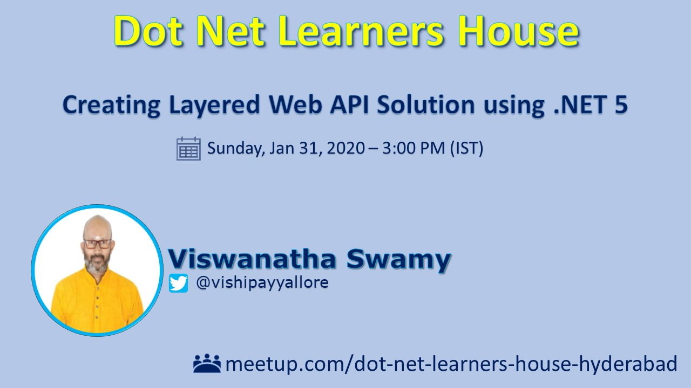
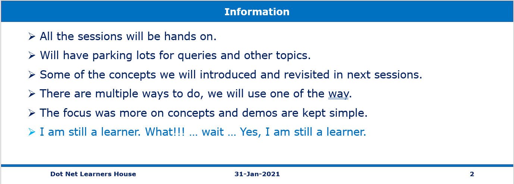

# Session 2 OF 15 (REST Web API using .Net 5, SQL Server)

## Pre-Requisites

### Software/Tools
> 1. .NET 5
> 1. VS 2019 Community Edition
> 1. Visual Studio Code
> 1. Postman
> 1. SQL Server 2016 and above 

### Knowledge
> 1. Basic C#
> 1. Basic EF Core
> 1. Basic knowledge of async/await

### Assumptions
> 1. Database is created and .sql scrips are ran.
> 1. Please refer to the ./Scripts Folder

## Technology Stack

> 1. .NET 5 SDK
> 1. Web API
> 1. Blazor WASM
> 1. Angular 11

## Information

## What we will be doing today
1. Resource Naming Guidelines
1. Action Return Types.
1. Status Codes
1. Application Core Layer | Business Logic Layer | SQL Data Access Layer
1. User Secrets instead of appSettings.json
1. Dependency Injection
1. Adding CORS (Cross-Origin Resource Sharing) to web API
1. Testing using Chrome Browser, Swagger, and Postman
1. Integrating Web API with Blazor WASM.

## How to Build and Execute the solution

### Create new Web API
> 1. Move the code into different libraries

### Project Structure
> 1. Demo / Discussion

### Program.cs, Startup.cs, ConfigureServices(), Configure() methods
> 1. Program.cs
> 1. Startup.cs
> 1. ConfigureServices()
> 1. Configure()

### launchSettings.json, and appSettings.json
> 1. launchSettings.json
> 1. appSettings.json

### Executing in IIS Express & Kestrel
> 1. Demo / Discussion

### Verify (Open API) Swagger UI
> 1. Demo / Discussion

### Introduction to Routing
> 1. Demo / Discussion

### Building Professor’s Controller (Using Folders for seperation)
> 1. Modify ProfessorsController.cs to use the code from libraries.
> 1. Modify WeatherForecastController.cs to refer the WeatherForecast model.

### Introduction Action Return Types
> 1. Demo / Discussion

### Implement GetAll() method
> 1. Adding Dependencies inside **ConfigureServices()** method of Startup.cs.
> 1. Consume the Professors BLL from the library.
> 1. User Secrets instead of appSettings.json. 

### Verify the controllers using Swagger and Chrome Browser
> 1. Demo / Discussion

## Look and Feel

## Create a New Blazor WASM
> 1. Create a new Blazor WASM project (**College.BlazorWasm.csproj**)

## Modify Blazor UI
> 1. MainLayout.razor.css
> 1. MainLayout.razor
> 1. app.css

## Modify to add two more menu items
> 1. NavMenu.razor
> 1. NavMenu.razor.css

## REST API Integration
> 1. Also reference College.Core.
> 1. Create ProfessorsFromWebAPI.razor, and ProfessorsFromWebAPI.cs.

