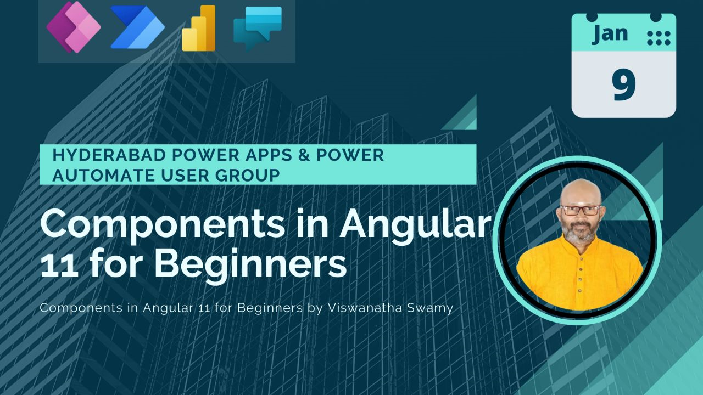
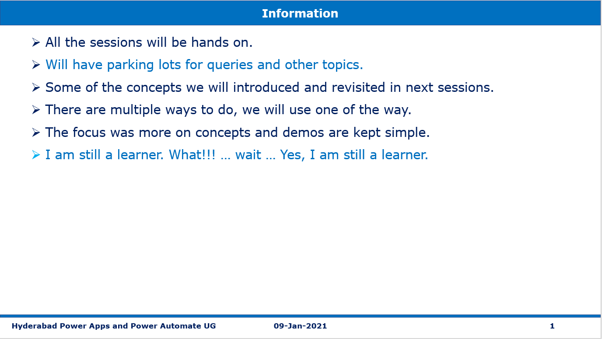
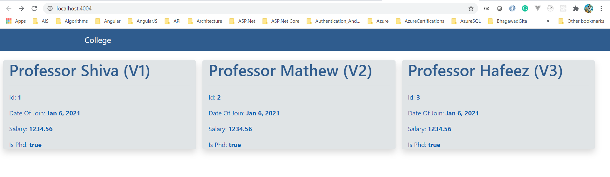

# Speaking Event - Hyderabad Power Apps and Power Automate User Group - 09-Jan-2021 - Angular 11



## Pre-Requisites

### Software/Tools
> 1. OS: win32 x64
> 1. Angular CLI: 11.0.5
> 1. Node: 14.15.1
> 1. Visual Studio Code
> 1. To be done

### Prior Knowledge
> 1. Html, CSS
> 1. Type Script
> 1. Java Script
> 1. Basic Angular

### Assumptions
> 1. NIL

## Technology Stack
> 1. Single Page Application using Angular 11

## Information


## UI Look and Feel


## How to Build and Execute the solution

### Create new Project and Execute
```
ng new college-webapp
npm start
```

### Few changes to the Project
> Modify package.json to open the browser during execution
> ```
> "start": "ng serve -o",
> ```
> Install **bootstrap** and **font-awesome**
> ```
> npm i bootstrap
> npm i font-awesome
> ```
> Modify angular.json to import CSS
> ```
> "styles": [
>     "src/styles.css",
>     "./node_modules/font-awesome/css/font-awesome.css",
>     "./node_modules/bootstrap/dist/css/bootstrap.css"
> ],
> ```
> Modify angular.json to change the default port **4200** to your choice of port **xxxx**
> ```
> "serve": {
>     "builder": "@angular-devkit/build-angular:dev-server",
>     "options": {
>         "browserTarget": "college-webapp:build",
>         "port": 4004
>     },
> }
> ```
> Clean up the **src/app/app.component.html** and add a **h1** Tag
> ```
> <h1>Hello World !!!</h1>
> ```
> Execute the **npm start** to view **Hello World !!!**

### What is a Component? 
Discussion

### Module, Decorator, Metadata. 
Discussion

### Bootstrapping AppComponent. 
Discussion

### Creating Component with Inline Template [Manual] 
> 1. Copy **interfaces** folder from **StarterFiles** folder into **src/app** folder.
> 1. Create **professorv1/professorv1.component.ts** folder insde **src/app** folder.
> 1. Selector, Template, Styles
> 1. Interpolation (One-way binding) Bind 
> 1. Modify the professorv1.component.ts file. Please refer to **StarterFiles** folder.
> 1. Add **Professorv1Component** inside declarations in app.module.ts file.
> 1. Using Component as a directive inside App.Component.html 
> 1. Run **npm start** to view the **Version 1** of Professors component.
> ```
> declarations: [
>   AppComponent,
>   Professorv1Component,
> ],
> ```

### Creating Component with Linked Template [Manual] 
> 1. Create **professorv2** folder insde **src/app** folder.
> 1. Create three files (professorv2.component.ts, professorv2.component.html, professorv2.component.css) inside **proferssorv2** folder.
> 1. Modify the three files. Please refer **professorv2** folder inside **StarterFiles** folder.
> 1. Add **Professorv2Component** inside declarations in app.module.ts file.
> 1. Using Component as a directive inside App.Component.html
> 1. Modify app.component.html to display both divs side-by-side.
> 1. Run **npm start** to view the **Version 1** and **Version 2** of Professors component.
> ```
> declarations: [
>   AppComponent,
>   Professorv1Component,
> ],
> ```

### 9. Selector, TemplateUrl, StyleUrls 

### 10. ng generate component demo 