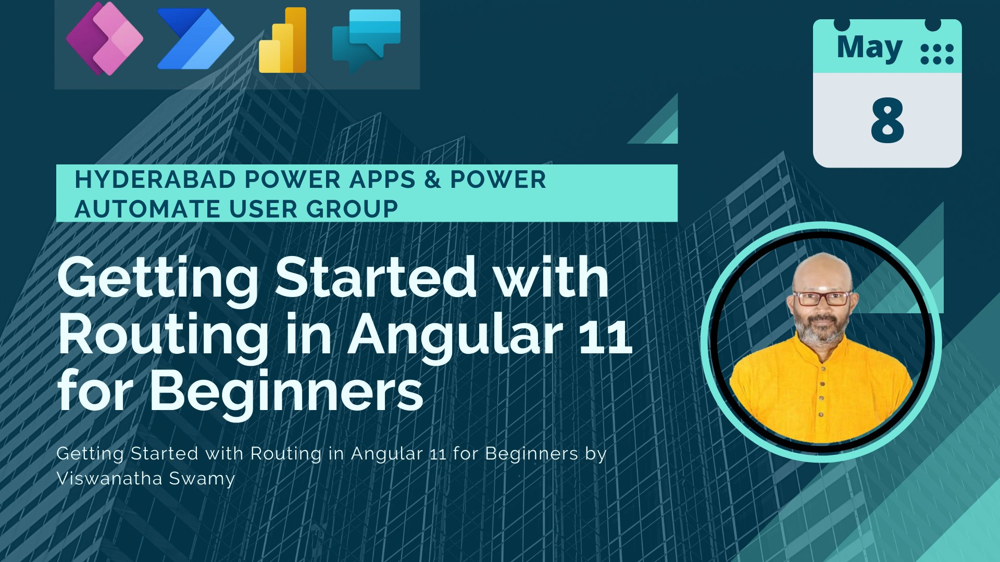
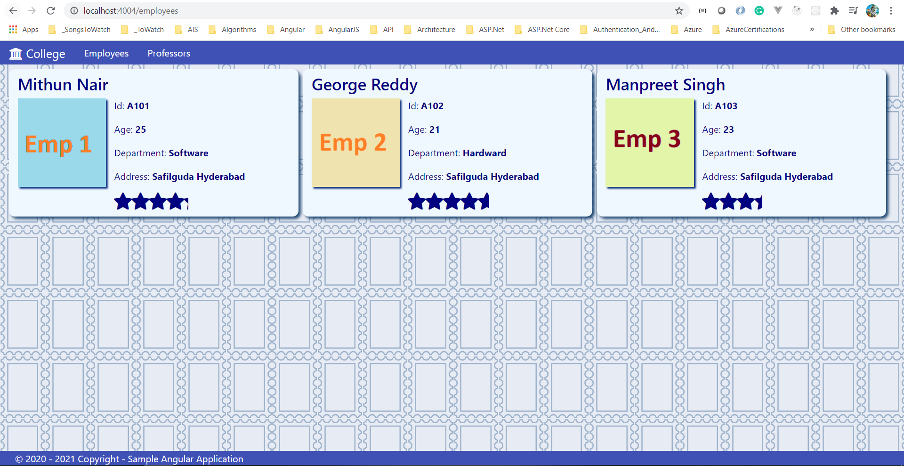
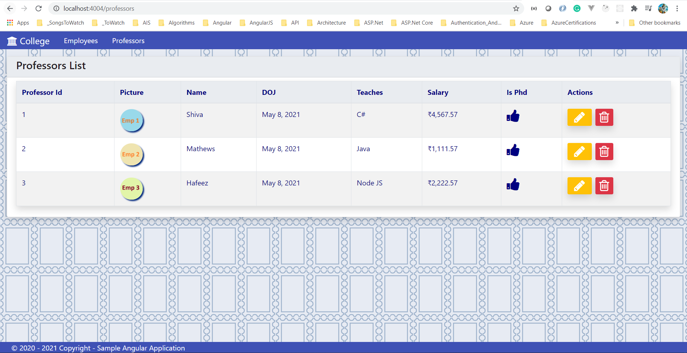

# Session **5 of 12** - Getting Started with Routing in Angular 11 for Beginners

> 1. Event Date: **08-May-2021**
> 1. Event URL: [Hyderabad Power Apps and Power Automate User Group](https://www.linkedin.com/feed/update/urn:li:activity:6795656293819453440/)


----------------------------------------------------------------------------------------------------------------

## Pre-Requisites

### Software/Tools
> 1. OS: win32 x64
> 1. Angular CLI: **11.2.11**
> 1. Node: **14.16.0**
> 1. Visual Studio Code

### Prior Knowledge
> 1. Html, CSS
> 1. Type Script
> 1. Java Script
> 1. Basic Angular

### Assumptions
> 1. NIL

## Technology Stack
> 1. Single Page Application using Angular 11

## Upgrade the Angular Cli/Core
```
ng update @angular/cli @angular/core
```

## Information


## UI Look and Feel

### Previous Session's UI **(Session 4)**


### Current Session's UI **(Session 5)**







----------------------------------------------------------------------------------------------------------------

## What are we doing today?
> 1. View the Session 4th's deployed Web App in Firebase
> 1. Clean up the previous session's code
> 1. Introduction to Routing
> 1. Creating the Routing 
> 1. Creating the Dashboard 
> 1. Navigate to Employee, and professors page
> 1. Adding Spinner to Employee, and professors page
> 1. Creating PageNotFound Component
> 1. Deploying Angular 11 application to Firebase

----------------------------------------------------------------------------------------------------------------

## How to Build and Execute the solution

### **1. View the Session 4th's deployed Web App in Firebase**
Demo

### **2. Clean up the previous session's code**

> 1. Modify styles.css.
> 1. Modify the Header. Add new Menu Items.
> 1. Modify the Footer component.


### **3. Introduction to Routing**

> 1. Route Segment, Router-Outlet discussiont.
> 1. https://angular.io/tutorial/toh-pt5 [Reference]

### **4. Creating the Routing**

> 1. Create a new Routing Module.

```
ng generate module app-routing --flat --module=app --dry-run
```

### **5. Creating the Dashboard**

> 1. Create the Dashboard Component.
> 1. Add the route to the Dashboard Component.
> 1. Add the "router-outlet" to the AppComponent.
> 1. Comment the Employees and Professors elements inside the AppComponent.
> 1. Update the Dashboard Component.

```
ng g c components/home/dashboard 

<div class="container">
    <router-outlet></router-outlet>
</div>
```


### **6. Navigate to Employee, and professors page**

> 1. Create the Route for Employees.
> 1. Create the Route for Professors.

```
const routes: Routes = [
  { path: 'dashboard', component: DashboardComponent },
  { path: 'employees', component: EmployeesListComponent },
  { path: 'professors', component: ProfessorsListComponent },
  { path: '', redirectTo: 'dashboard', pathMatch: 'full' }
];
```

### **7. Adding Spinner to Employee, and professors page**
> 1. Modify Employees, and Professors HTML page and TypeScript Component.
> 1. Modify the styles.css.


### **8. Creating PageNotFound Component**
> 1. Create a new PageNotfound Component.
> 1. Update the routing to accomodate the PageNotFound component.
> 1. Update the PageNotFound HTML.

```
ng g c components/shared/page-notfound

const routes: Routes = [
  { path: 'dashboard', component: DashboardComponent },
  { path: 'employees', component: EmployeesListComponent },
  { path: 'professors', component: ProfessorsListComponent },
  { path: 'pagenotfound', component: PageNotfoundComponent },
  { path: '', redirectTo: 'dashboard', pathMatch: 'full' },
  { path: '**', redirectTo: 'pagenotfound', pathMatch: 'full' }
];
```

### **9. Deploying Angular 11 application to Firebase**
> 1. Create a new project in FireBase.
> 1. Create a Hosting 
> 1. Create Cloud Firestore

**Ensure that you are specifying "dist/collegewebapp" as public folder**
```
install -g firebase-tools
ng build --prod
firebase login
ng add @angular/fire
firebase init
firebase deploy --only hosting:ng11-webapp (ng11-webapp === Firebase Project Name)
```

----------------------------------------------------------------------------------------------------------------

