# Creating Custom Connector, and using it in Canvas App on 23-Oct-2021 at 04.45 PM IST


## Event URL: [https://www.linkedin.com/events/powerplatformclassmates6855192446750482432](https://www.linkedin.com/events/powerplatformclassmates6855192446750482432)


---

## Information

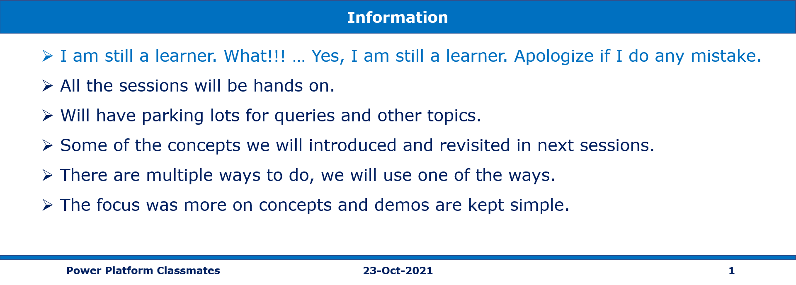

## What are we doing today?

> 1. Viewing the existing Web API
> 1. Introduction to Custom Connector
> 1. Creating a Custom Connector from blank
> 1. Testing the Custom Connector
> 1. Creating Canvas App and using Custom Connector
> 1. SUMMARY / RECAP / Q&A


---

## 1. Viewing the existing Web API

> 1. Discussion
> 1. Accessing the API using Postman

URL: [https://conferenceapi.azurewebsites.net/](https://conferenceapi.azurewebsites.net/)

### Web API
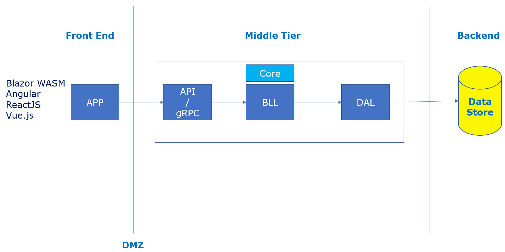

### Verifying Web API in Postman
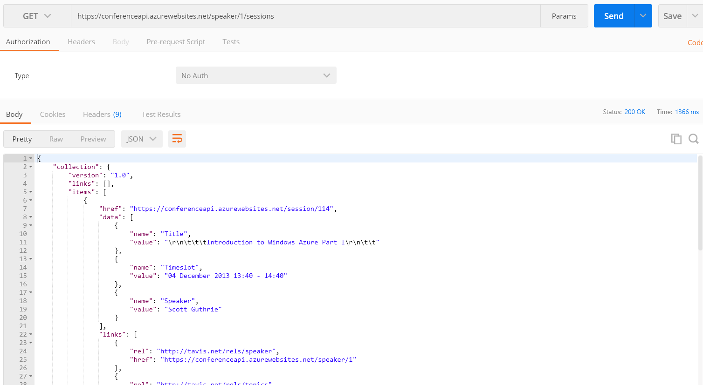

---

## 2. Introduction to Custom Connector
> 1. Discussion

URL: [https://docs.microsoft.com/en-us/connectors/custom-connectors](https://docs.microsoft.com/en-us/connectors/custom-connectors/)

---

## 3. Creating a Custom Connector from blank
> 1. Discussion

### Commands
```
curl --request GET --url https://conferenceapi.azurewebsites.net/speaker/1/sessions --header 'cache-control: no-cache' --header 'postman-token: 9cb2466c-a614-19ee-5151-b6f74f9afbff'

```

### Custom Connector using Blank
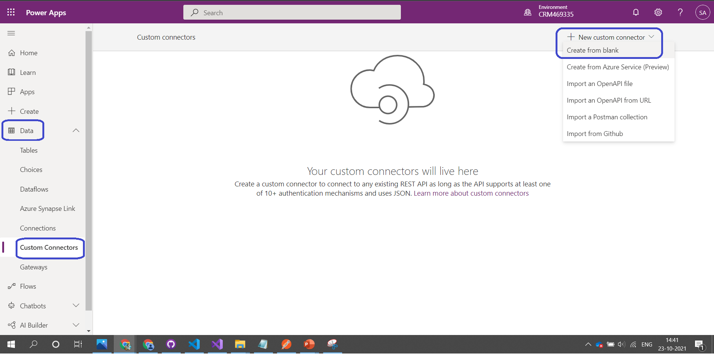

---

## 4. Testing the Custom Connector
> 1. Discussion

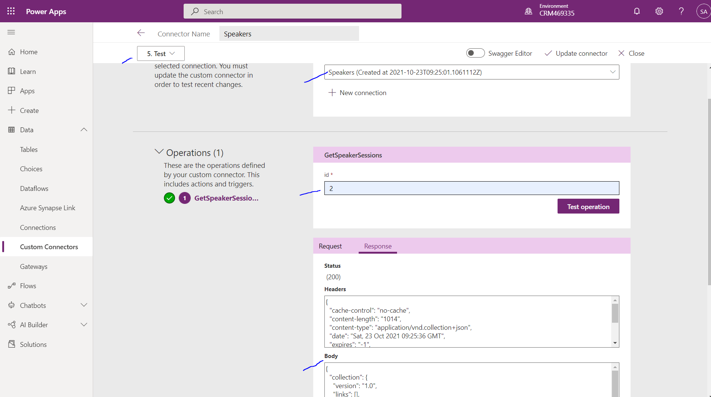

---

## 5. Creating Canvas App and using Custom Connector

> 1. Create Canvas App from Blank
> 1. Change the Layout
> 1. Add Data -> Speakers
> 1. Add TextBox, Two Galleries

```
SpeakerSessions.GetSpeakerSessions(TextInput1.Text).collection.items

If(ThisItem.IsSelected, RGBA(214, 223, 238, 1), RGBA(241, 244, 249, 1))

Gallery1.Selected.data

PlainText(ThisItem.value)
```

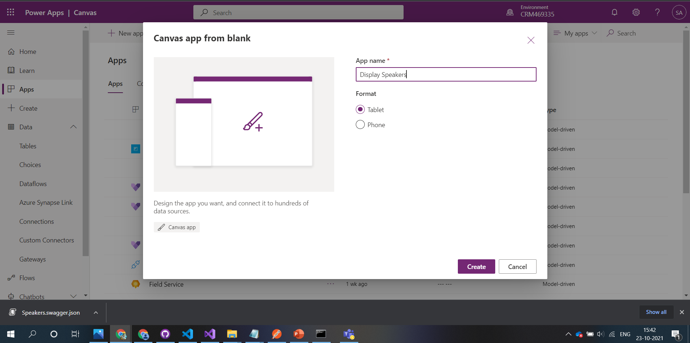
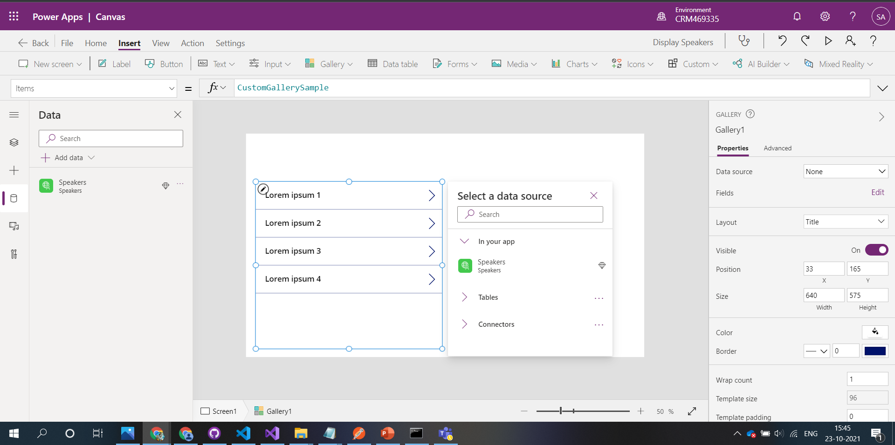
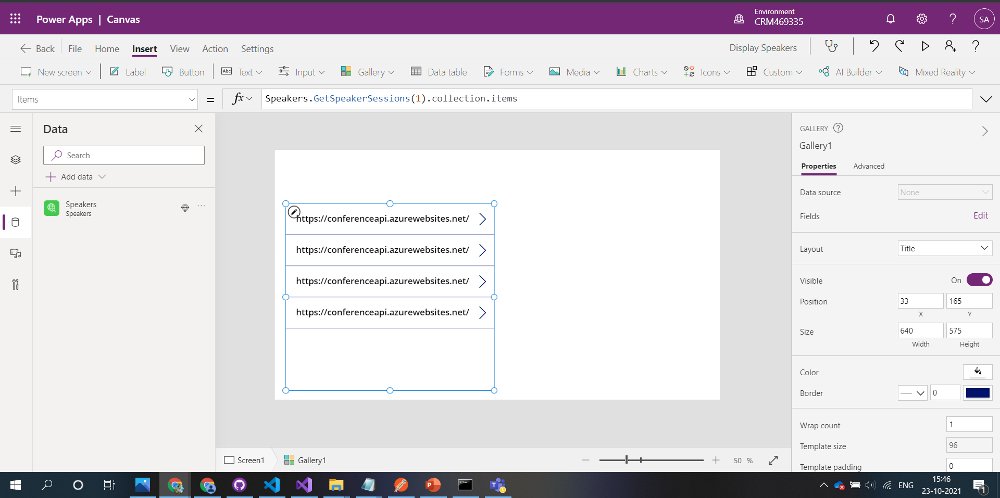
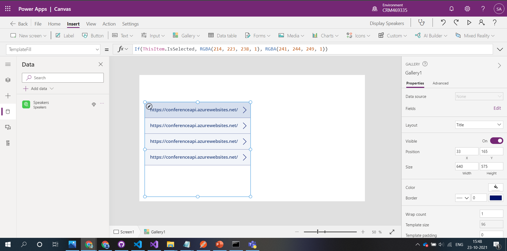
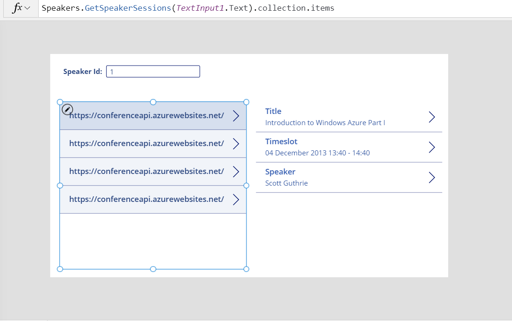
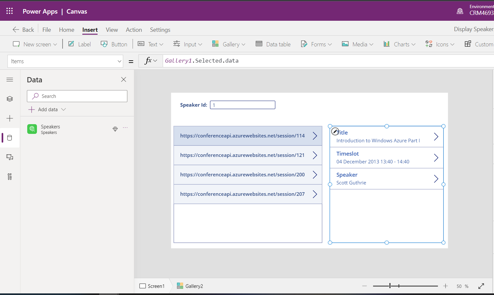
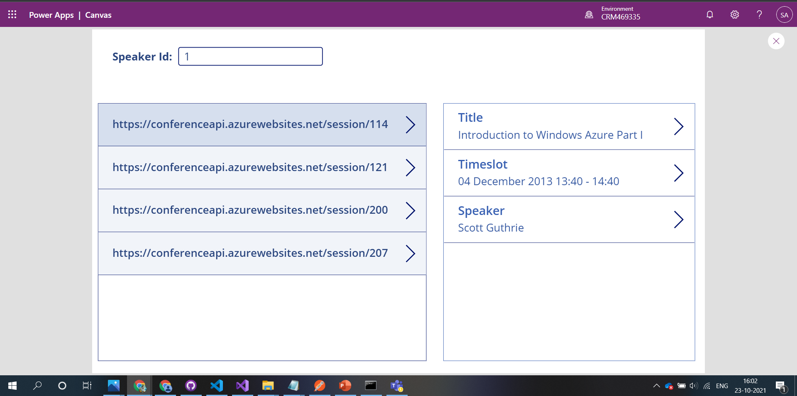

---

## 6. SUMMARY / RECAP / Q&A

---

> 1. SUMMARY / RECAP / Q&A
> 2. Any open queries, I will get back through meetup chat/twitter.

---


