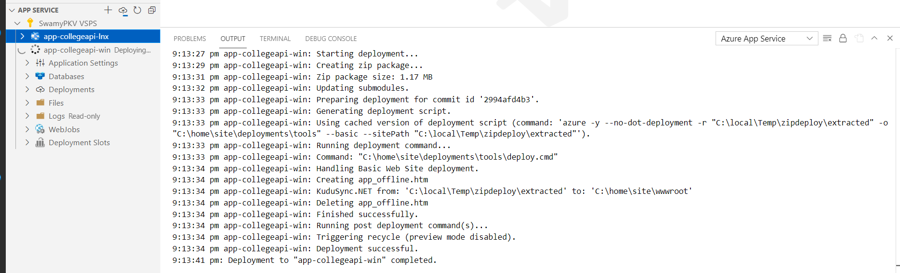

# Hands-on Creating Azure App Service Web Apps 15-Sep-2021 at 09:00 AM IST

## Event URL: [https://www.meetup.com/microsoft-reactor-bengaluru/events/280462794/](https://www.meetup.com/microsoft-reactor-bengaluru/events/280462794/) 


---


## Application Architecture Diagram 

To be done

---

## Resources in Azure

To be done

## Information


## What are we doing today?
> 1. App Service Plans
> 1. Creating Web App (Linux) in Portal, and deploying it from VS Code
> 1. Checking the code into GitHub.
> 1. Creating Web App (Windows) using Azure CLI, and deploying using Azure CLI.
> 1. Creating the Web App using ARM template using cloud shell, and deploying using VS 2019.


*****

## 1. Introduction to Azure App Service
> 1. App Service Overview
> 1. App Service Plans
> 1. Pricing Tiers
> 1. Ways to Deploy code to App Service
>    1. Manual
>    1. Automated

## 2. Creating Web App (Windows) in Portal, and deploying it from VS Code
> 1. Creating Web App (Windows) in Portal
> 1. Walk through simple Web API using .NET 6
> 1. Execute the below mentioned code to publish the binaries into a folder
> 1. Deploying it from VS Code


```
dotnet publish -c release -o ./publish
```



## 3. Creating Web App (Linux), and deploying it from VS Code

> 1. Creating Web App (Linux) in Portal
> 1. Walk through simple Web API using .NET 6
> 1. Execute the below mentioned code to publish the binaries into a folder
> 1. Deploying it from VS Code


```
dotnet publish -c release -o ./publish
```


## 4. Create a static HTML web app using `az webapp up`
> 1. Walk through of the Html App
> 1. Login using `az login`
> 1. Verify the account `az account show`
> 1. Execute the `az webapp up`

```
az login

az account show

az webapp up --location EastUs --name hellohtml04092021 --resource-group rg-az204-webapps-reactor-001
 --html
```


## 5. Creating Web App, and deploying it using Azure CLI (Laptop) 
> 1. Walk through of the **Angular 12** App
> 1. Login using `az login`
> 1. Verify the account `az account show`
> 1. Execute the `az webapp up`

## 6. SUMMARY / RECAP / Q&A 

*****
> 1. SUMMARY / RECAP / Q&A 
> 2. Any open queries, I will get back through meetup chat/twitter.
*****

## What is Next? (`Session 2 of Azure App Services` on 29-Sep-2021)
> 1. Creating Web App, and deploying it using PowerShell
> 1. Creating Web App Azure CLI (Cloud Shell) and deploying using VS 2019
> 1. Creating the Web App using ARM template using cloud shell, and deploying using VS 2019
> 1. Creating Web App (Linux) in Portal, and deploying it from VS Code
> 1. Creating Azure SQL Server and Database. Deploying .SQLPROJ to Azure SQL.
> 1. Connecting Azure SQL from Local Web API
> 1. Configuring Diagnostics Logs. Streaming Logs, and Access Log files
> 1. Deploying the Web API changes to Web App
> 1. Configuring the SQL Azure Connection String in App Settings in Azure


