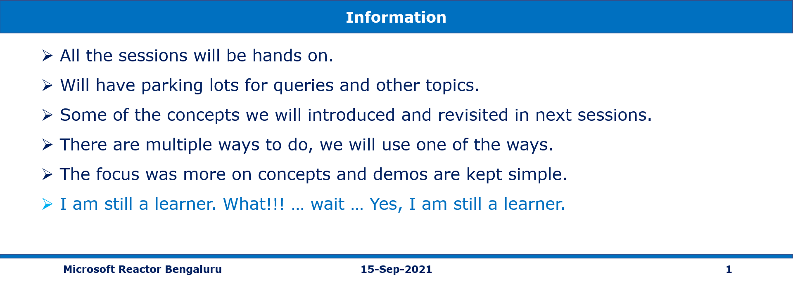

# Hands-on Creating Azure App Service Web Apps 15-Sep-2021 at 09:00 AM IST

## Event URL: [https://www.meetup.com/microsoft-reactor-bengaluru/events/280462794/](https://www.meetup.com/microsoft-reactor-bengaluru/events/280462794/) 

---

## Application Architecture Diagram 

---

## Resources in Azure

## Information

## What are we doing today?
> 1. App Service Plans
> 1. Creating Web App (Linux) in Portal, and deploying it from VS Code
> 1. Checking the code into GitHub.
> 1. Creating Web App (Windows) using Azure CLI, and deploying using Azure CLI.
> 1. Creating the Web App using ARM template using cloud shell, and deploying using VS 2019.

> 1. Creating SQL tables in Azure SQL.
> 1. Storing the SQL Credentials inside the Key Vault.
> 1. Deploying Web API to App Server.
> 1. Configuring the Web API to use the credentials from Key Vault
> 1. Verifying Web API using Postman.
> 1. Deploying Blazor WASM, and integrating with Web API.

*****

## 1. Introduction to Azure App Service
> 1. App Service Overview
> 1. App Service Plans
> 1. Pricing Tiers
> 1. Ways to Deploy code to App Service

## 2. Creating Web App (Linux) in Portal, and deploying it from VS Code
> 1. Creating Web App (Linux) in Portal
> 1. Deploying it from VS Code
> 1. Checking the code into GitHub
> 1. Redeploy the code

## 3. Creating Web App (Linux) in Portal, and deploying it from VS Code

## 4. Creating Web App, and deploying it using PowerShell

## 5. Creating Web App, and deploying it using Azure CLI

## 6. Creating the Web App using ARM template using cloud shell, and deploying using VS 2019

## 7. Create a static HTML web app using az webapp up

## 8. SUMMARY / RECAP / Q&A 

*****
> 1. SUMMARY / RECAP / Q&A 
> 2. Any open queries, I will get back through meetup chat/twitter.
*****