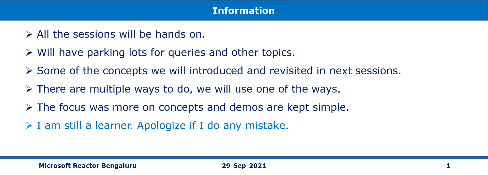
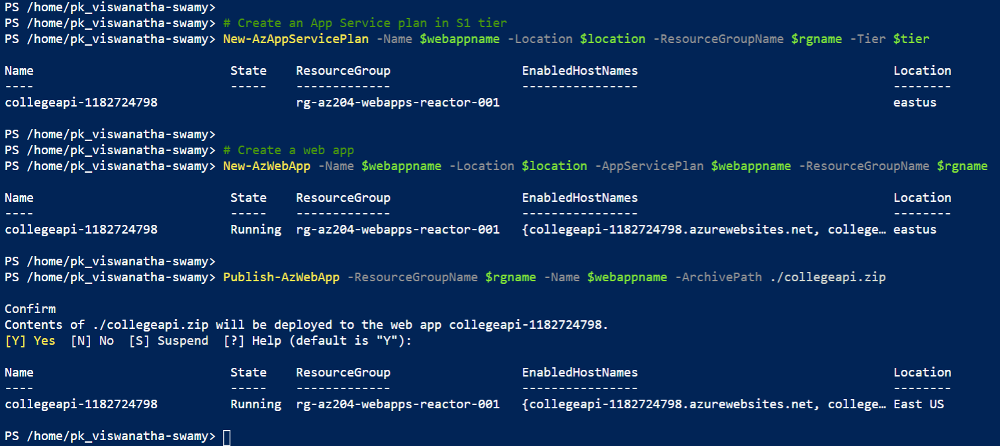

# Azure Web Apps (.NET 5 Web API), Azure SQL, App Settings and Connection String 29-Sep-2021 at 09:00 AM IST

## Session **2** of **20** Sessions

## Event URL: [https://www.meetup.com/microsoft-reactor-bengaluru/events/280816393](https://www.meetup.com/microsoft-reactor-bengaluru/events/280816393) 


---


## Application Architecture Diagram 


---

## Resources in Azure

```
To Be Done
```

## Information


## What are we doing today?
> 1. Creating Web App, and deploying it using PowerShell
> 1. Creating Web App Azure CLI (Cloud Shell) and deploying using VS 2019
> 1. Creating the Web App using ARM template using cloud shell, and deploying using VS 2019
> 1. Creating Azure SQL Server and Database. Deploying .SQLPROJ to Azure SQL
> 1. Connecting Azure SQL from Local Web API
> 1. Deploying the Web API changes to Web App
> 1. Configuring the SQL Azure Connection String in App Settings in Azure
> 1. Verifying the Web API using Postman
> 1. SUMMARY / RECAP / Q&A 


*****

## 1. Creating Web App, and deploying it using PowerShell
> 1. Execute the commands from **CreateWebApp.ps1**. It will create the Web App
> 1. Navigate to Azure Portal and change it Runtime Stack to .NET 5
> 1. Navigate to https://shell.azure.com/
> 1. Copy the contents of **publish** folder into clouddrive
> 1. Execute `zip -r collegeapi.zip *` to zip the contents of the publish folder
> 1. Move the collegeapi.zip to the $home folder
> 1. Execute `Publish-AzWebApp` to publish the .zip to Web App
> 1. Navigate to the `https://collegeapi-1240671420.azurewebsites.net/weatherforecast` to view the output

```
zip -r collegeapi.zip *

mv ./clouddrive/publish/collegeapi.zip .

Publish-AzWebApp -ResourceGroupName $rgname -Name collegeapi-1037543007 -ArchivePath ./collegeapi.zip
```



## 2. Creating Web App Azure CLI (Cloud Shell) and deploying using VS 2019
> 1. Discussion on Cloud Shell
> 1. Discussion on VS code `Azure Extensions`
> 1. Discussion on VS 2019 `Cloud Explorer`
> 1. Execute the commands from **DOTNETCORE_WebApp.sh**. It will create the Web App
> 1. Deploy the Web API using VS 2019


## 3. Creating the Web App using ARM template using cloud shell, and deploying using VS 2019
> 1. Discussion on ARM Architecture
> 1. Discussion on ARM templates
> 1. Deploy using Cloud Shell

Reference: https://docs.microsoft.com/en-us/azure/app-service/quickstart-arm-template?pivots=platform-linux


## 4. Creating Azure SQL Server and Database. Deploying .SQLPROJ to Azure SQL
> 1. Create the SQL Server, and SQL Database in Azure Portal
> 1. Create the SQL Server, and SQL Database in Azure Portal


## 5. Connecting Azure SQL from Local Web API
> 1. Discuss the layered API
> 1. Discussion on AppSettings.json, and Secrets.json
> 1. Show case the Dependency Injection Container using Debugging
> 1. Show case the how the Dependencies are injected using Debugging
> 1. Verify the local Web API is able to retrieve the data using Swagger UI, and Postman

## 6. Deploying the Web API changes to Web App
> 1. Publish the changes 

## 7. Configuring the SQL Azure Connection String in App Settings in Azure
> 1. Discussion on App Settings
> 1. Discussion on Configuring Connection Strings

## 8. Verifying the Web API using Postman
> 1. Verify that we are able to retrieve the content from API hosted in Azure 

## 9. SUMMARY / RECAP / Q&A 

*****
> 1. SUMMARY / RECAP / Q&A 
> 2. Any open queries, I will get back through meetup chat/twitter.
*****

## What is Next? (`Session 3` of `20 Sessions` on 13-Oct-2021)
> 1. Secure your Azure SQL Database
> 1. Creating Ubuntu VM and installing nginx using PowerShell. Use SSH Keys instead of password. Accessing the default page.
> 1. Creating Windows VM and installing IIS using PowerShell. Accessing the default page.
> 1. Creating Ubuntu VM and installing LAMP Server using Azure CLI. Use SSH Keys instead of password. Accessing the default page.
> 1. Creating Windows VM and installing IIS using Azure CLI. Accessing the default page.
> 1. Creating Ubuntu VM using ARM template and Azure CLI. Use SSH Keys instead of password. Accessing the default page.
> 1. Creating Windows VM using ARM template and Azure CLI. Accessing the default page.
