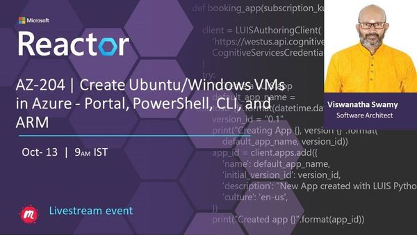
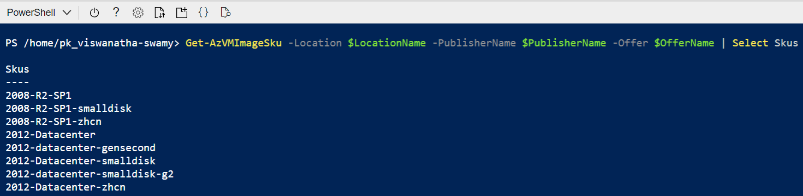
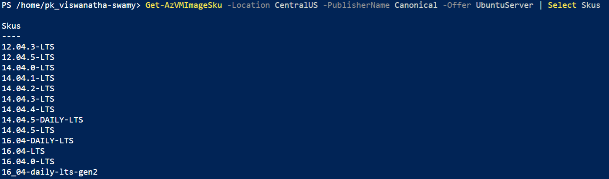
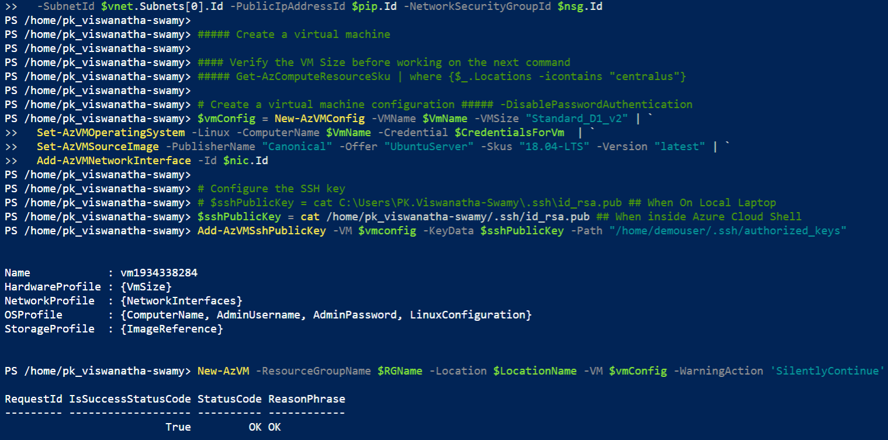
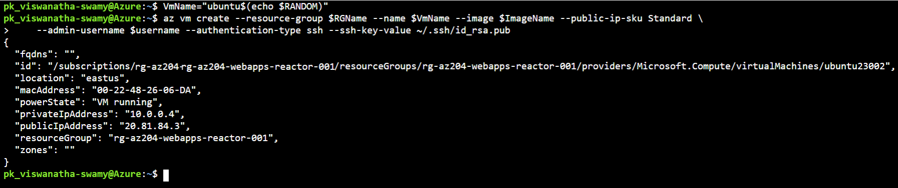
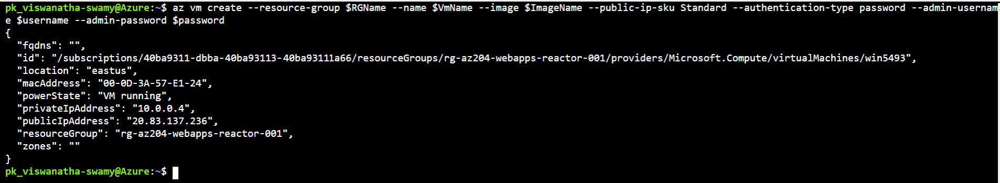

# Create Ubuntu/Windows VMs in Azure - Portal, PowerShell, CLI, and ARM on 13-Oct-2021 at 09:00 AM IST

## Session **3** of **20** Sessions

## Event URL: [https://www.meetup.com/microsoft-reactor-bengaluru/events/281043714](https://www.meetup.com/microsoft-reactor-bengaluru/events/281043714)



---

## Application Architecture Diagram


---

## Resources in Azure

```
To Be Done
```

## Information


## What are we doing today?

> 1. Introduction to Virtual Machines
> 1. Creating Ubuntu VM and installing nginx using PowerShell. Use SSH Keys instead of password. Accessing the default page
> 1. Creating Windows VM and installing IIS using PowerShell. Accessing the default page
> 1. Creating Ubuntu VM and installing LAMP Server using Azure CLI. Use SSH Keys instead of password. Accessing the default page
> 1. Creating Windows VM and installing IIS using Azure CLI. Accessing the default page
> 1. Creating Ubuntu VM using ARM template and Azure CLI. Use SSH Keys instead of password. Accessing the default page
> 1. Creating Windows VM using ARM template and Azure CLI. Accessing the default page
> 1. Secure your Azure SQL Database
> 1. SUMMARY / RECAP / Q&A


---

## 1. Introduction to Virtual Machines

> 1. To be done

### Search VM Images

`infrastructure\VMs\PowerShell\SearchVms.ps1`





## 2. Creating Ubuntu VM and installing nginx using PowerShell

**Note:** Use SSH Keys instead of password

> 1. Discussion and Demo



## 3. Creating Windows VM and installing IIS using PowerShell

> 1. Discussion and Demo


## 4. Creating Ubuntu VM and installing LAMP Server using Azure CLI

**Note:** Use SSH Keys instead of password

> 1. Discussion and Demo



## 5. Creating Windows VM and installing IIS using Azure CLI

> 1. Discussion and Demo



## 6. Creating Ubuntu VM using ARM template and Azure CLI

**Note:** Use SSH Keys instead of password

> 1. Discussion and Demo


## 7. Creating Windows VM using ARM template and Azure CLI

> 1. Discussion and Demo


## 8. Secure your Azure SQL Database

> 1. Discussion and Demo

## 9. SUMMARY / RECAP / Q&A

---

> 1. SUMMARY / RECAP / Q&A
> 2. Any open queries, I will get back through meetup chat/twitter.

---

## What is Next? (`Session 4` of `20 Sessions` on 27-Oct-2021)

> 1. Secure your Azure SQL Database
> 1. Availability Zone, Availability Set, Proximity, Azure Spot Instance
> 1. Back up your virtual machines, Azure Bastion
> 1. Deploying ASP.Net Core Web API into IIS inside Azure VM
> 1. Deploying ASP.Net Razor Application into IIS inside Azure VM
> 1. Integrating ASP.Razor and ASP.Net Core Web API
> 1. Deploying Blazor WASM Application into IIS inside Azure VM
> 1. Integrating Blazor WASM and ASP.Net Core Web API
