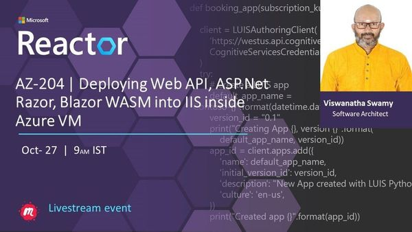
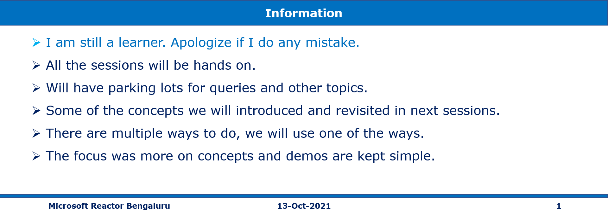
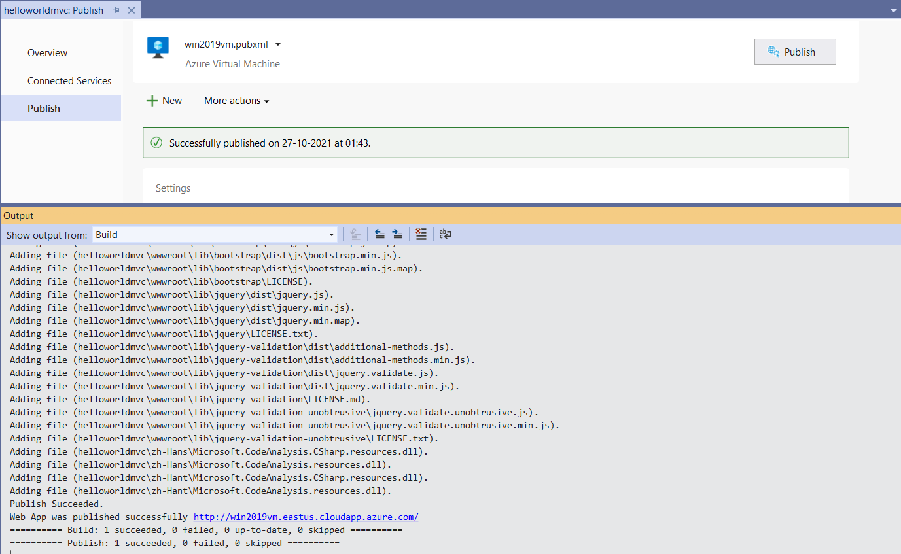
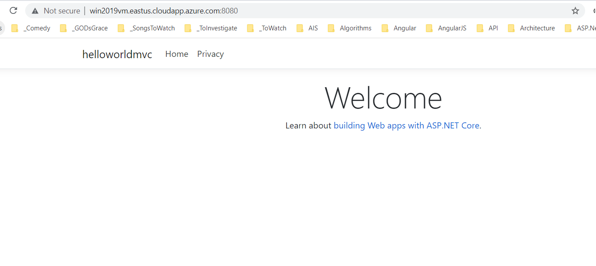

# Deploying Web API, ASP.Net Razor, Blazor WASM into IIS inside Azure VM on 27-Oct-2021 at 09:00 AM IST

## Session **4** of **20** Sessions

## Event URL: [https://www.meetup.com/microsoft-reactor-bengaluru/events/281044033](https://www.meetup.com/microsoft-reactor-bengaluru/events/281044033)



---

## Application Architecture Diagram


---

## Resources in Azure

```
To Be Done
```

## Information



## What are we doing today?

> 1. Fault Domain, Update Domain
> 1. Availability Set
> 1. Availability Zone
> 1. Azure Spot Instance, Reserve Instance
> 1. Proximity
> 1. Deploying ASP.Net Razor Application into IIS inside Azure VM
> 1. Deploying ASP.Net Core Web API into Nginx inside Ubuntu VM
> 1. Integrating ASP.Razor and ASP.Net Core Web API
> 1. SUMMARY / RECAP / Q&A


---

## 1. Fault Domain, Update Domain

> 1. Discussion

## 2. Availability Set

> 1. Discussion and Demo

## 3. Availability Zone

> 1. Discussion

## 4. Azure Spot Instance

> 1. Discussion

## 5. Reserve Instance

> 1. Discussion

## 6. Proximity

> 1. Discussion

## 7. Deploying ASP.Net Razor Application into IIS inside Azure VM

### Step 1

> 1. Windows 2019 Data Center VM

### Step 2

> 1. Assign Static IP, and DNS name to the VM
> 1. `VM Overview` -> `Essentials` -> `DNS name`
> 1. Added In-bound port rule for 8172, 8080 to NSG

### Step 3

> 1. RDP into the VM
> 1. Verify & Add Inbound Firewall rule for 8172, 8080 inside the VM
> 1. Install IIS Server and Restart the VM
> 1. Install .Net 5, and .Net Core Hosting Bundle, Web Deploy 3.6 and Restrat the VM
> 1. Verify the Asp.Net Core Module exists in IIS
> 1. Create a new Web Site in IIS (MvcWebApp)

URL: https://docs.microsoft.com/en-us/iis/publish/using-web-deploy/introduction-to-web-deploy

### Step 4

> 1. Create a .Net 5 Web App in Visual Studio 2019
> 1. Verify it locally.
> 1. Create new publish profile


### Step 5

> 1. Deploy the application to VM
> 1. Modify the Web.Config
> 1. Verify the application works locally inside the VM
> 1. Verify the application works using FQDN & IP outside the VM.





## 8. SUMMARY / RECAP / Q&A

---

> 1. SUMMARY / RECAP / Q&A
> 2. Any open queries, I will get back through meetup chat/twitter.

---

## What is Next? (`Session 5` of `20 Sessions` on 10-Nov-2021)

> 1. Back up your virtual machines, Azure Bastion
> 1. Deploying ASP.Net Core Web API into Nginx inside Ubuntu VM
> 1. Deploying Blazor WASM Application into IIS inside Azure VM
> 1. Integrating ASP.Razor and ASP.Net Core Web API
> 1. Integrating Blazor WASM and ASP.Net Core Web API
> 1. Secure your Azure SQL Database
