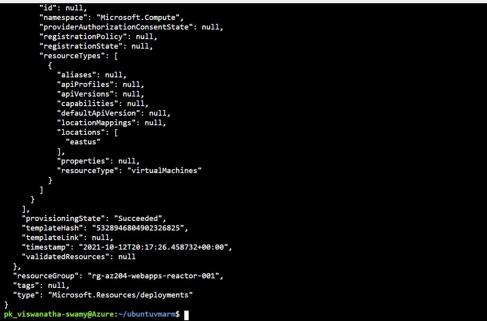

# Deploying Web API, ASP.Net Razor, Blazor WASM into IIS inside Azure VM on 27-Oct-2021 at 09:00 AM IST

## Session **4** of **20** Sessions

## Event URL: [https://www.meetup.com/microsoft-reactor-bengaluru/events/281044033](https://www.meetup.com/microsoft-reactor-bengaluru/events/281044033)


---

## Application Architecture Diagram


---

## Resources in Azure

```
To Be Done
```

## Information


## What are we doing today?

> 1. Fault Domain, Update Domain
> 1. Availability Set
> 1. Availability Zone
> 1. Azure Spot Instance, Reserve Instance
> 1. Proximity
> 1. Deploying ASP.Net Core Web API into Nginx inside Ubuntu VM
> 1. Deploying ASP.Net Razor Application into IIS inside Azure VM
> 1. Integrating ASP.Razor and ASP.Net Core Web API
> 1. SUMMARY / RECAP / Q&A


---

## 1. Fault Domain, Update Domain

> 1. Discussion


## 2. Availability Set

> 1. Discussion and Demo


## 3. Availability Zone

> 1. Discussion

## 4. Azure Spot Instance, Reserve Instance

> 1. Discussion


## 5. Proximity

> 1. Discussion


## 6. Deploying ASP.Net Core Web API into Nginx inside Ubuntu VM

> 1. Discussion and Demo



## 7. Deploying ASP.Net Razor Application into IIS inside Azure VM

> 1. Discussion and Demo


## 8. Integrating ASP.Razor and ASP.Net Core Web API

> 1. Discussion and Demo

## 9. SUMMARY / RECAP / Q&A

---

> 1. SUMMARY / RECAP / Q&A
> 2. Any open queries, I will get back through meetup chat/twitter.

---

## What is Next? (`Session 5` of `20 Sessions` on 10-Nov-2021)

> 1. Back up your virtual machines, Azure Bastion
> 1. Deploying Blazor WASM Application into IIS inside Azure VM
> 1. Integrating Blazor WASM and ASP.Net Core Web API
> 1. Secure your Azure SQL Database
