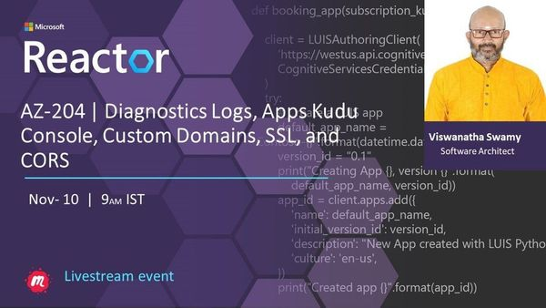
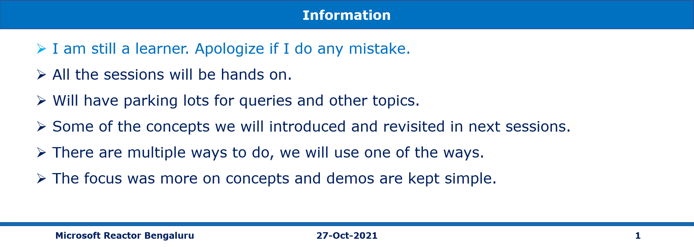

# Diagnostics Logs, Apps Kudu Console, Custom Domains, SSL, and CORS on 10-Nov-2021 at 09:00 AM IST

## Session **5** of **20** Sessions

## Event URL: [https://www.meetup.com/microsoft-reactor-bengaluru/events/281044187](https://www.meetup.com/microsoft-reactor-bengaluru/events/281044187)



---

## Application Architecture Diagram


---

## Resources in Azure

```
To Be Done
```

## Information



## What are we doing today?

> 1. Configuring Diagnostics Logs. Streaming Logs, and Access Log files
> 1. Web App Console, App Service Editor, and Kudu Console
> 1. Custom Domains and attaching to the Web App
> 1. Web App SSL
> 1. Enabling CORS and accessing using Angular 12 App
> 1. SUMMARY / RECAP / Q&A


---

## 1. Configuring Diagnostics Logs. Streaming Logs, and Access Log files

> 1. Discussion & Demo

## 2. Web App Console, App Service Editor, and Kudu Console

> 1. Discussion and Demo

## 3. Custom Domains and attaching to the Web App

> 1. Deploy Angular 12 App to Azure
> 1. Create a Custom Domain
> 1. Attach the Custom Domain to the Web App

## 4. Web App SSL

> 1. Discussion & Demo

## 5. Enabling CORS and accessing using Angular 12 App

> 1. Discussion & Demo

## 8. SUMMARY / RECAP / Q&A

---

> 1. SUMMARY / RECAP / Q&A
> 2. Any open queries, I will get back through meetup chat/twitter.

---

## What is Next? (`Session 5` of `20 Sessions` on 10-Nov-2021)

> 1. Back up your virtual machines, Azure Bastion
> 1. Deploying ASP.Net Core Web API into Nginx inside Ubuntu VM
> 1. Deploying Blazor WASM Application into IIS inside Azure VM
> 1. Integrating ASP.Razor and ASP.Net Core Web API
> 1. Integrating Blazor WASM and ASP.Net Core Web API
> 1. Secure your Azure SQL Database
