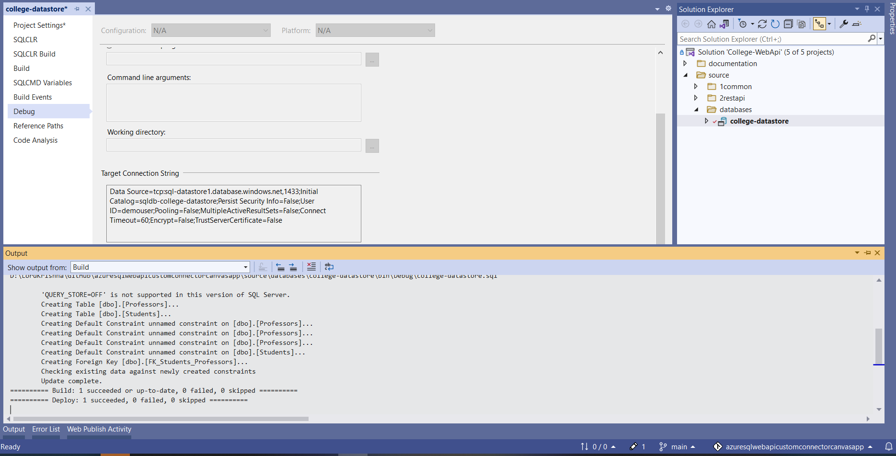
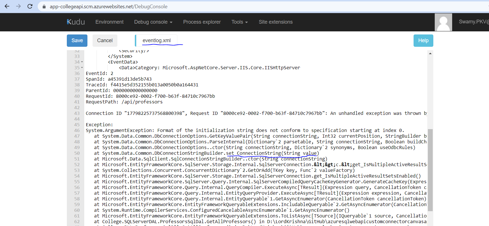
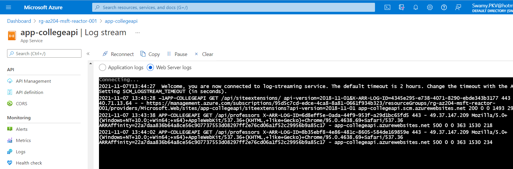
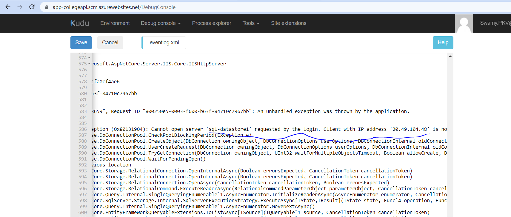
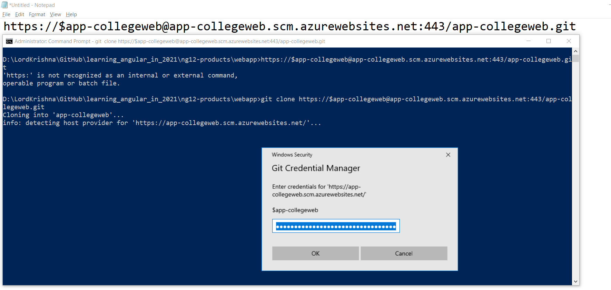

# Diagnostics Logs, Apps Kudu Console, Custom Domains, SSL, and CORS on 10-Nov-2021 at 09:00 AM IST

## Session **5** of **20** Sessions

## Event URL: [https://www.meetup.com/microsoft-reactor-bengaluru/events/281044187](https://www.meetup.com/microsoft-reactor-bengaluru/events/281044187)

## Youtube URL: To be added


---

## Application Architecture Diagram


---


## Information


## What are we doing today?

> 1. Deploy **.sqlproj** into Azure SQL Server
> 1. Deploy .NET 6 Web API to Azure App Service
> 1. Web App Console, App Service Editor, and Kudu Console
> 1. Veiw Event Log inside Kudu Console
> 1. Configuring Diagnostics Logs. Streaming Logs, and Access Log files
> 1. Deploy Angular 12 Web App to Azure App Service
> 1. Custom Domains and attaching to the Web App
> 1. Web App SSL
> 1. Enabling CORS and accessing using Angular 12 App
> 1. SUMMARY / RECAP / Q&A


---

## 1. Deploy **.sqlproj** into Azure SQL Server using VS 2022
> 1. Discussion & Demo



## 2. Deploy .NET 6 Web API to Azure App Service using VS 2022
> 1. Discussion & Demo


## 3. Web App Console, App Service Editor, and Kudu Console

> 1. Discussion & Demo

### Web App Console


### App Service Editor


### Kudu Console


## 4. Veiw Event Log inside Kudu Console
> 1. Discussion & Demo



## 5. Configuring Diagnostics Logs. Streaming Logs, and Access Log files
> 1. Discussion & Demo

### Streaming Logs


### Event Log files


## 6. Deploy Angular 12 Web App to Azure App Service
> 1. Discussion & Demo
> 1. Set the `Source` to `Local Git`
> 1. Clone the repository into `dist` folder
> 1. Execute `ng build` and copy the content from `dist/ng12-products` into `dist/app-collegeweb`
> 1. Deploy the Web App to Azure App Service


```
https://$app-collegeweb@app-collegeweb.scm.azurewebsites.net:443/app-collegeweb.git

git add .
git commit -m "deploy angular 13 app"
git push

```

### Clone into **dist** folder


### Deploy Angular 13 To Azure


### Deployed Angular 13 In Azure


## 7. Custom Domains and attaching to the Web App
> 1. Discussion & Demo

## 8. Web App SSL
> 1. Discussion & Demo

## 9. Enabling CORS and accessing using Angular 12 App
> 1. Discussion & Demo


## 10. SUMMARY / RECAP / Q&A

---

> 1. SUMMARY / RECAP / Q&A
> 2. Any open queries, I will get back through meetup chat/twitter.

---

## What is Next? (`Session 6` of `20 Sessions` on 24-Nov-2021)

> 1. Introduction to Docker
> 1. Build and store images by using Azure Container Registry
> 1. Deploy a web app by using an image from an Azure Container Registry repository
> 1. Create and deploy a web app from a Docker image
> 1. Update the image and automatically redeploy the web app
> 1. Modify the image and redeploy the web app
