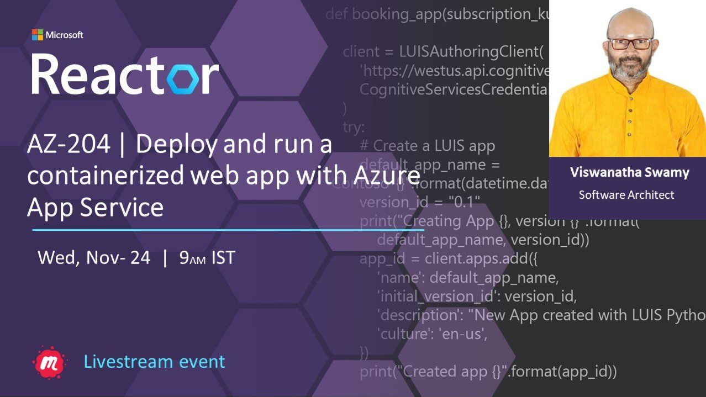
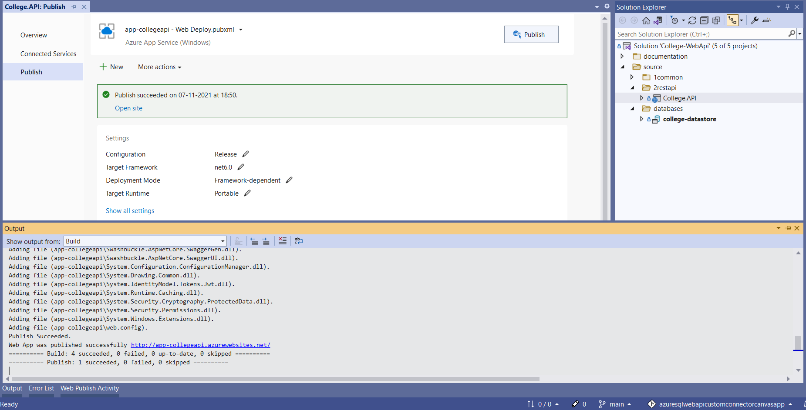
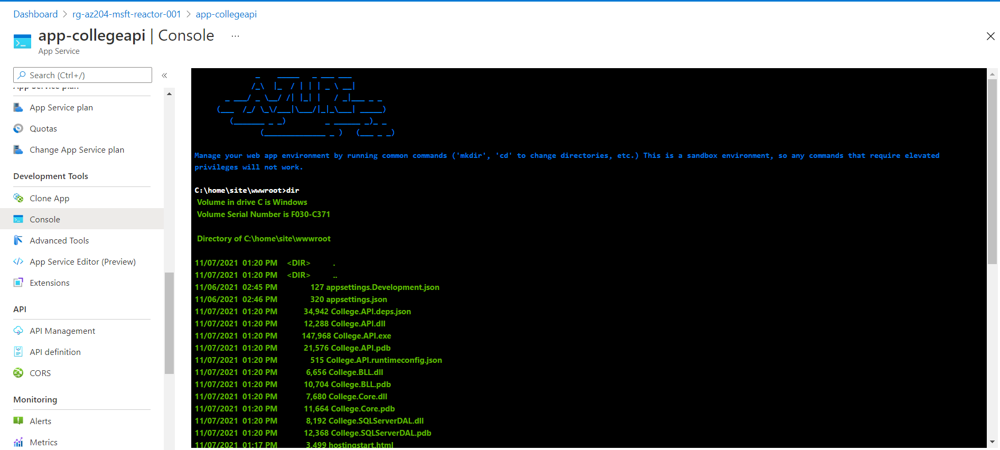
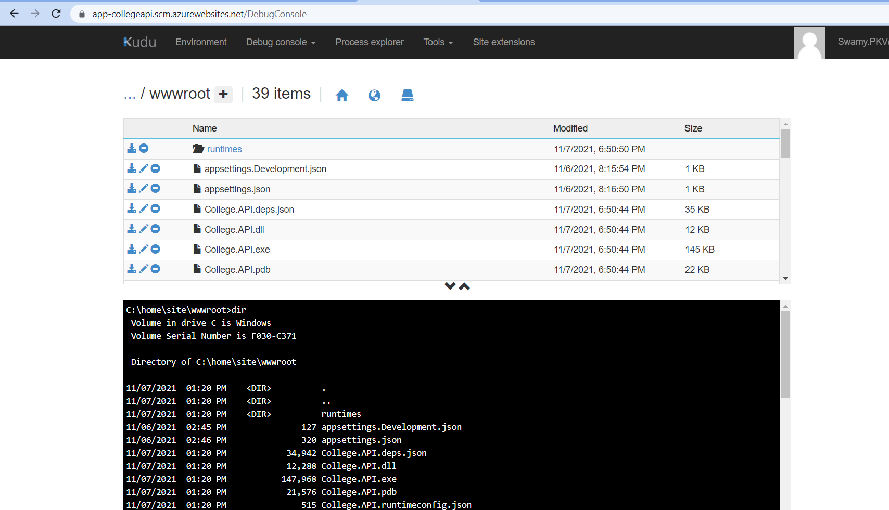
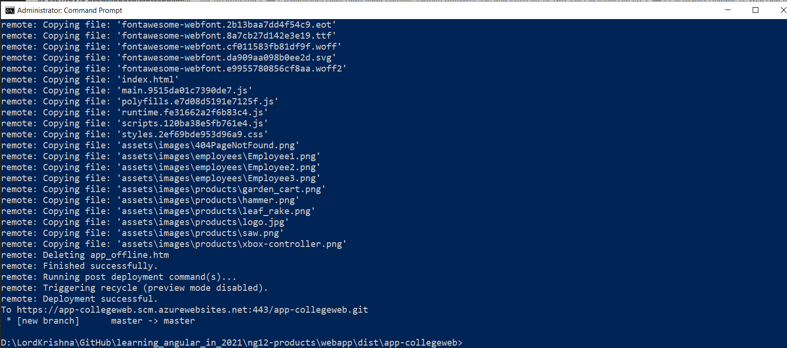
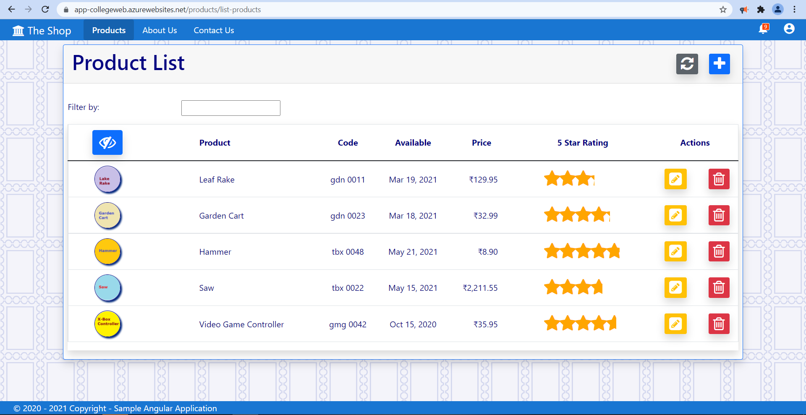
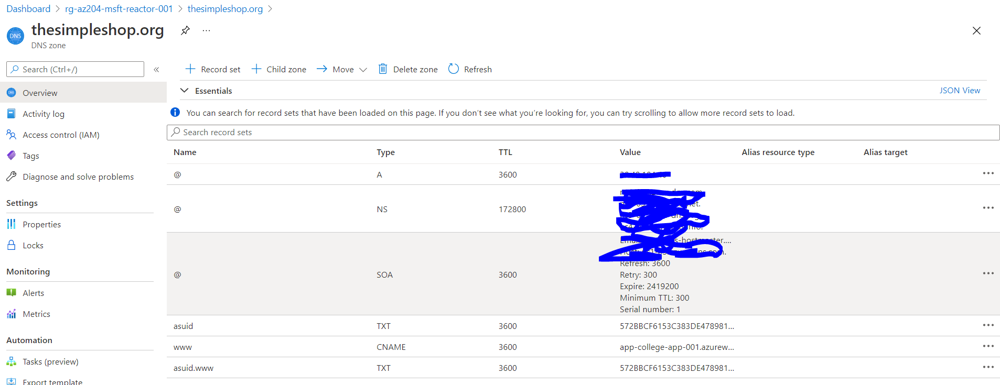
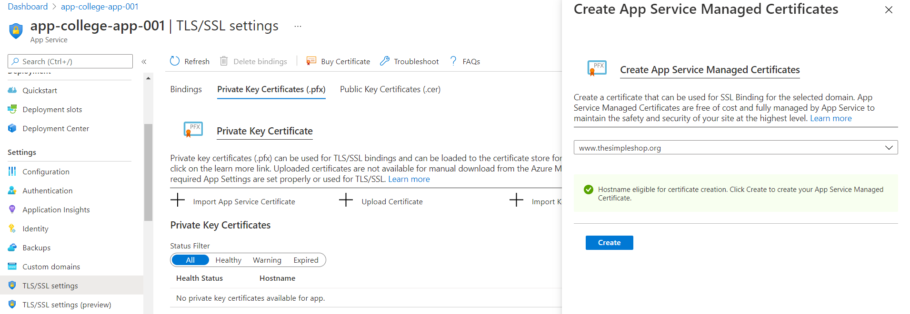
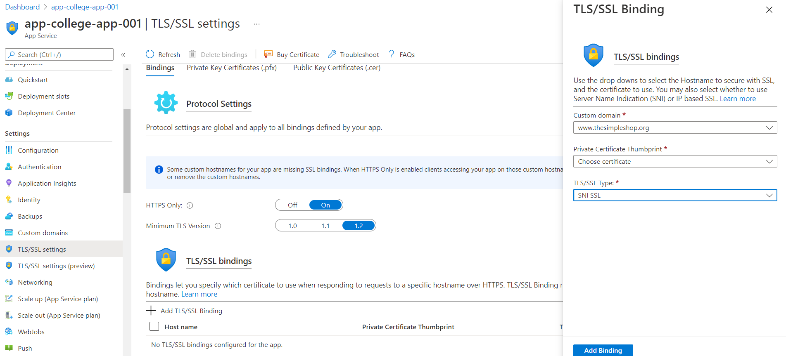
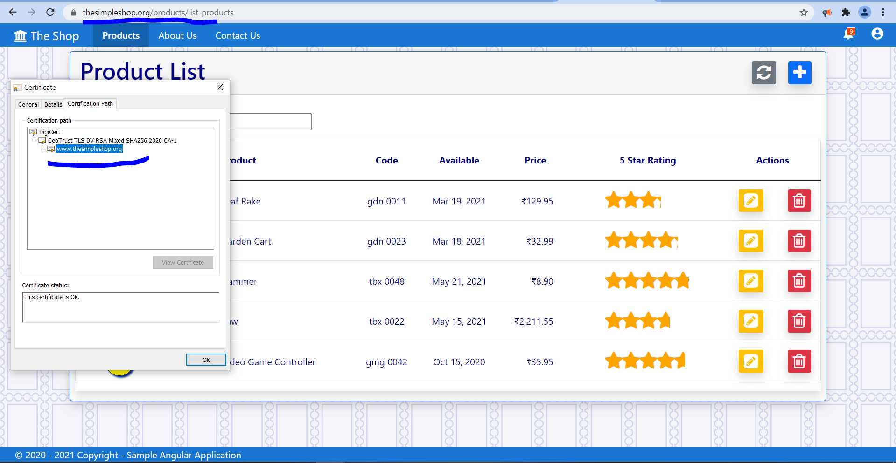

# Deploy and run a containerized web app with Azure App Service

## Session **6** of **20** Sessions

## Date Time: 24-Nov-2021 at 09:00 AM IST

## Event URL: [https://www.meetup.com/microsoft-reactor-bengaluru/events/281044187](https://www.meetup.com/microsoft-reactor-bengaluru/events/281044187)

## Youtube URL: To be added



---

## Application Architecture Diagram


---


## Information


## What are we doing today?

> 1. Introduction to Docker
> 1. Build and store images by using Azure Container Registry
> 1. Deploy a web app by using an image from an Azure Container Registry repository
> 1. Create and deploy a web app from a Docker image
> 1. Update the image and automatically redeploy the web app
> 1. Modify the image and redeploy the web app
> 1. SUMMARY / RECAP / Q&A


---

**Note: ** 

>1. `.sqlproj` and `Web API` GitHub: [https://github.com/vishipayyallore/azuresqlwebapicustomconnectorcanvasapp](https://github.com/vishipayyallore/azuresqlwebapicustomconnectorcanvasapp)
> 1. `Angular 13 UI` GitHub: [https://github.com/vishipayyallore/learning_angular_in_2021/tree/master/ng12-products](https://github.com/vishipayyallore/learning_angular_in_2021/tree/master/ng12-products)

## 1. Introduction to Docker
> 1. Discussion & Demo


## 2. Introduction to Docker Hub, and Azure Container Registry
> 1. Discussion & Demo

## 3. Introduction to Azure Container Instances
> 1. Discussion & Demo

> 1. Build and store images by using Azure Container Registry
> 1. Deploy a web app by using an image from an Azure Container Registry repository
> 1. Create and deploy a web app from a Docker image
> 1. Update the image and automatically redeploy the web app
> 1. Modify the image and redeploy the web app


## 2. Deploy .NET 6 Web API to Azure App Service using VS 2022
> 1. Discussion & Demo



## 3. Web App Console, App Service Editor, and Kudu Console

> 1. Discussion & Demo

### Web App Console


### App Service Editor


### Kudu Console



## 4. Veiw Event Log inside Kudu Console
> 1. Discussion & Demo


## 5. Configuring Diagnostics Logs. Streaming Logs, and Access Log files
> 1. Discussion & Demo

### Streaming Logs


### Event Log files


## 6. Deploy Angular 12 Web App to Azure App Service
> 1. Discussion & Demo
> 1. Set the `Source` to `Local Git`
> 1. Clone the repository into `dist` folder
> 1. Execute `ng build` and copy the content from `dist/ng12-products` into `dist/app-collegeweb`
> 1. Deploy the Web App to Azure App Service


```
https://$app-collegeweb@app-collegeweb.scm.azurewebsites.net:443/app-collegeweb.git

git add .
git commit -m "deploy angular 13 app"
git push

```

### Clone into **dist** folder


### Deploy Angular 13 To Azure


### Deployed Angular 13 In Azure


## 7. Enabling CORS and accessing using Angular 12 App
> 1. Discussion & Demo

**References:**
> 1. https://docs.microsoft.com/en-us/azure/app-service/app-service-web-tutorial-custom-domain?tabs=cname
> 1. https://docs.microsoft.com/en-us/azure/app-service/configure-ssl-bindings

## 8. Custom Domains and attaching to the Web App
> 1. Create the `App Service Domain`
> 1. It will create a `App Service Domain` and `DNS Zone`
> 1. Go to Web App -> Custom Domains -> `+ Add Custom Domain`
> 1. Enter the `App Service Domain` name `www.thesimpleshop.com` -> `Validate`
> 1. Create `CNAME` and `TXT` inside the `DNS Zone`



## 9. Web App SSL
> 1. Web App -> TLS/SSL Settings -> `Http Only`
> 1. Web App -> `Private Key Certificates (.pfx)` -> `+ Create App Service Managed Certificates`
> 1. Web App -> TLS/SSL Settings -> `+ Add TLS/SSL Binding`

### SSL Certificate Creation


### SSL Binding


### Angular 13 App with Custom Domain and SSL Binding



## 10. SUMMARY / RECAP / Q&A

---

> 1. SUMMARY / RECAP / Q&A
> 2. Any open queries, I will get back through meetup chat/twitter.

---

## What is Next? (`Session 7` of `20 Sessions` on 08-Dec-2021)

### Two Mini Projects
> 1. Warm Up Project - Http Trigger - NodeJS - ArrayOperations
> 1. Hello World Project - HTTP, Timer, and Queue Trigger with Blob, and Queue Input/Output Bindings

### Topics
> 1. Introduction to Azure Functions
> 1. Creating Azure Functions using multiple methods
> 1. Creating Azure Functions in C#, and Node JS
> 1. Execute Azure Functions with triggers [Http, and Blob]
> 1. Execute Azure Functions with input/output bindings
> 1. Monitoring Azure Functions with Application Insights
