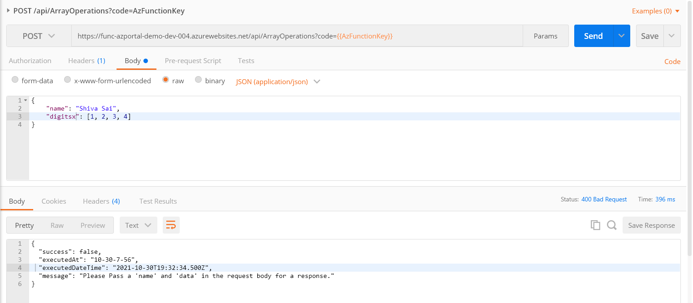

# AZ-204 | Creating Azure Functions using Azure Portal with 2 Mini Projects

## Date Time: 08-Dec-2021 at 09:00 AM IST
## Event URL: [https://www.meetup.com/microsoft-reactor-bengaluru/events/281837685](https://www.meetup.com/microsoft-reactor-bengaluru/events/281837685)


---

## Pre-Requisites

> 1. .NET 3.1/6 SDK
> 1. Azure Function Core Tools
> 1. Azure CLI
> 1. Azure Functions VS Code Extension

### Software/Tools

> 1. OS: win32 x64
> 1. Node: **v14.17.5**
> 1. Visual Studio Code
> 1. Visual Studio 2019/2022

### Prior Knowledge

> 1. C#, Node JS
> 1. Azure Storage
> 1. Azure Functions
> 1. Blazor WASM

### Assumptions

> 1. NIL

## Technology Stack

> 1. Azure Functions

## Information

## 

## What are we doing today?

> 1. Introduction to Azure Functions
> 1. Creating Azure Functions using multiple methods
> 1. Creating Azure Functions in C#, and Node JS
> 1. Execute Azure Functions with triggers [Http, Blob, and Timer]
> 1. Execute Azure Functions with input/output bindings
> 1. Monitoring Azure Functions with Application Insights

## Two Mini Projects

> 1. Mini Project 1 - Http Trigger - NodeJS - `ArrayOperations`
> 1. Mini Project 2 - Http, Timer, and Queue `Trigger` with Blob, and Queue `Input/Output Bindings`

---


---

## 1. Introduction to Azure Functions

**Note:** Discussion

> 1. Faas (Function as a Service) is a service that allows you to create and run serverless functions on Azure.
> 1. Triggers: Http, Timer, Blob, Queue, ServiceBus, EventHub, etc.
> 1. Bindings: Input, Output, etc. (Queue, Blob, CosmosDb, ServiceBus, EventHub, etc.)
> 1. Hosting Models: Consumption Plan, App Service, Premium, Docker Container.
> 1. Environments: Azure Portal, VS 2019/2022, Azure Function Core tools, VS Code.
> 1. Security, Identify Provider Integration, Function Chaining, Durable Functions

URLs:
> 1. https://docs.microsoft.com/en-us/azure/azure-functions/functions-triggers-bindings?tabs=csharp

## 2. Monitoring Azure Functions with Application Insights

**Note:** Hands ON

> 1. It will be ongoing activity throughout the workshop

## 3. Creating Azure Functions using multiple methods

**Note:** Discussion

> 1. Create a new Azure Function App using Azure Portal
> 1. Create a new Azure Function App using Azure Function Core Tools
> 1. Create a new Azure Function App using Azure Functions VS Code Extension
> 1. Create a new Azure Function App using Visual Studio 2019/2022

## 4. Creating Azure Functions in C#, and Node JS

**Note:** Hands ON

> 1. Function App: One or more functions with common configuration, scale together
> 1. Creating `Hello World` Azure Function using C#
> 1. Creating `Hello World` Azure Function using Node JS

---

## 5. Mini Project 1 - `ArrayOperations`

**Note:** Http Trigger | NodeJS | `ArrayOperations`

**Description:**

We will create a Azure Function App named **func-azportal-demo-dev-004** with node runtime. It will have a Http Trigger Azure Function which will accept "name, and data" as part of POST call. We will also add "lodash" package using Kudu Console.

**Steps:**
1. Create a Function App called "func-azportal-demo-dev-001"
1. Add a Function called **ArrayOperations**
1. Code and Test Tab
1. Testing using Browser (GET)
1. Integration Tab
1. Monitor Tab
1. Storage Account Explorer
1. Kudu Console
1. Testing using Postman (POST)

```
npm init -y
npm install lodash
```

**Note:** Images for Reference


**Receiving Http Status Code 400 when we don't send the proper inputs to Azure Function**



**Receiving Http Status Code 200 when we send the proper inputs to Azure Function**


---

## 6. Mini Project 2 - Http, Timer, and Queue `Trigger` with Blob, and Queue `Input/Output Bindings`

**Note:**
WriteToSBQ | ReadFromSBQ | ReadFromBlob | SendMsgToSBQ

### Execute Azure Functions with triggers [Http, Timer, Blob and Service Bus Queue]

**Note:** Hands ON

> 1. Creating Azure Function using Http Trigger
> 1. Creating Azure Function using Queue Trigger
> 1. Creating Azure Function using Timer Trigger

### Execute Azure Functions with input/output bindings

**Note:** Hands ON

> 1. Adding Blob output binding for the Http Trigger
> 1. Adding Blob output binding for the Queue Trigger. It has Queue as Input binding
> 1. Adding Queue output binding for the Timer Trigger

---


## 7. SUMMARY / RECAP / Q&A

---

> 1. SUMMARY / RECAP / Q&A
> 2. Any open queries, I will get back through meetup chat/twitter.

---

## What is Next? (`Session 8` of `20 Sessions` on 15-Dec-2021)

### Two Mini Projects
> 1. Mini Project 1 - GitHub Code Change Tracker (Node JS)
> 1. Mini Project 2 - Simple App with Azure Function (C#) & Blazor

### Topics
> 1. Monitoring Azure Functions with Application Insights
> 1. Create Http Triggered Azure Function (Blob, and Table bindings)
> 1. Configure WebHooks in GitHub
> 1. Integrate GitHub WebHooks with Azure Functions
> 1. APIs using Azure Functions in Visual Studio Code in C#
> 1. Retrieve GitHub Code Changes - HTTP Trigger
> 1. Blazor WASM Web App UI to display those changes.
> 1. Deploying the code to Azure
