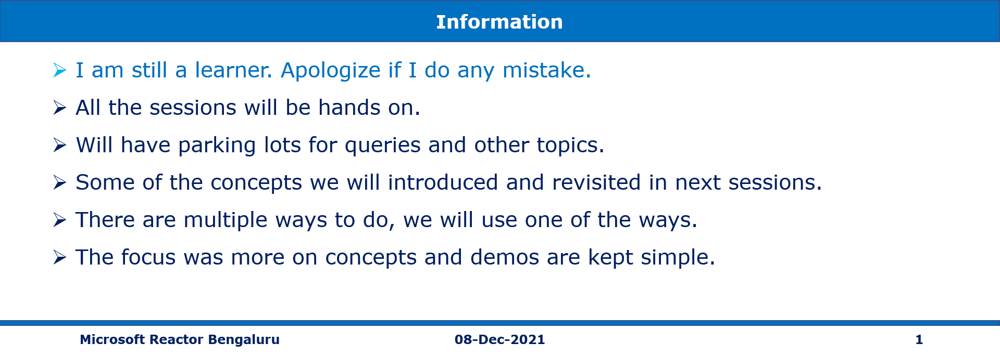
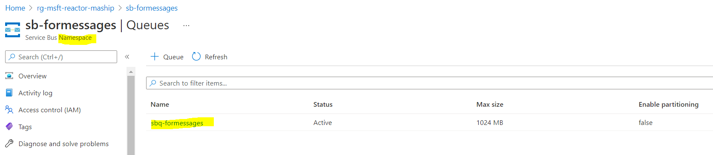
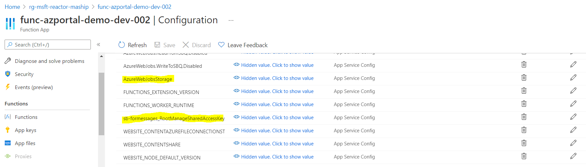
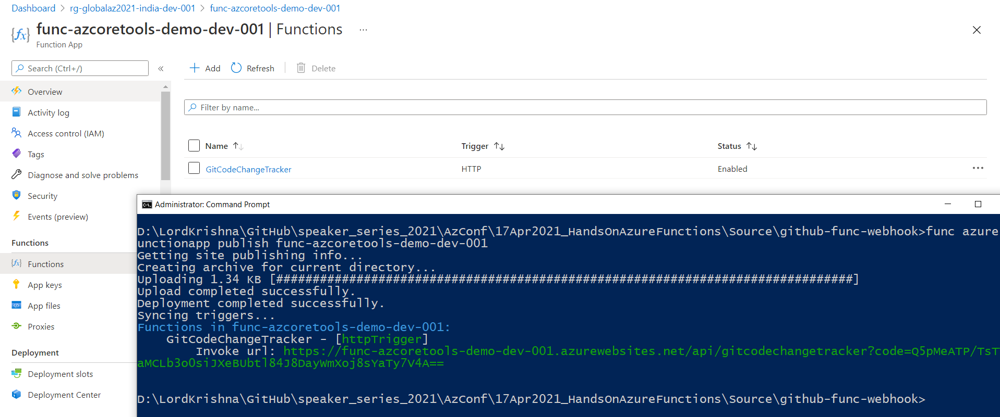
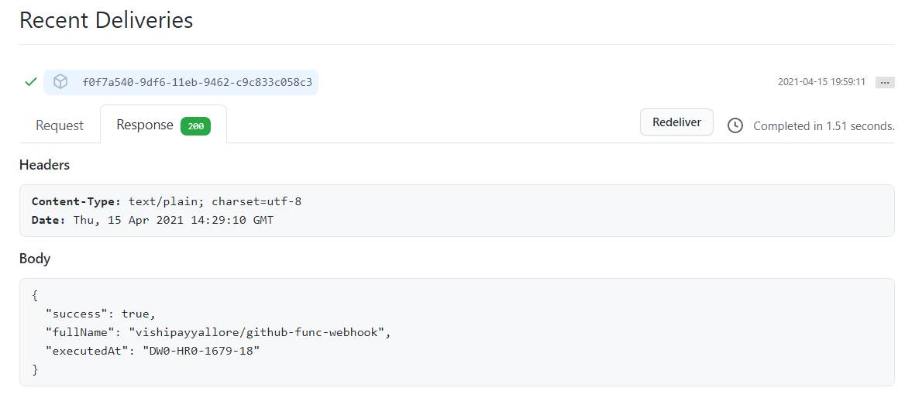
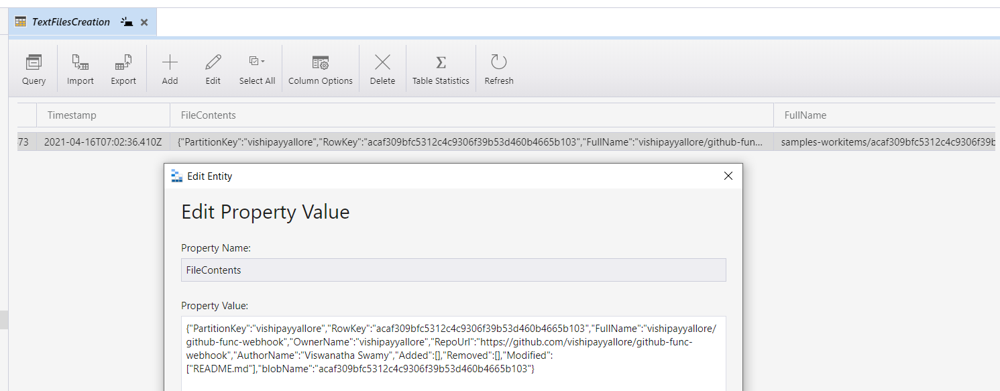
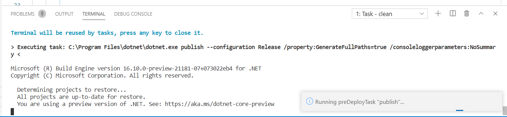
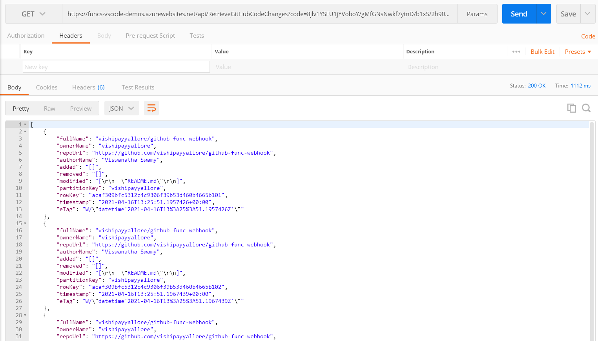

# AZ-204 | Creating Azure Functions using Azure Portal with 2 Mini Projects

# AZ-204 | Creating Azure Functions using Azure CLI, VS Code (2 Mini Projects)

## Date Time: 08-Dec-2021 at 09:00 AM IST

## Event URL: [https://www.meetup.com/microsoft-reactor-bengaluru/events/281837685](https://www.meetup.com/microsoft-reactor-bengaluru/events/281837685)


---

## Date Time: 15-Dec-2021 at 09:00 AM IST

## Event URL: [https://www.meetup.com/microsoft-reactor-bengaluru/events/281837836](https://www.meetup.com/microsoft-reactor-bengaluru/events/281837836)


---

## Pre-Requisites

> 1. .NET 3.1/6 SDK
> 1. Azure Function Core Tools
> 1. Azure CLI
> 1. Azure Functions VS Code Extension

### Software/Tools

> 1. OS: win32 x64
> 1. Node: **v14.17.5**
> 1. Visual Studio Code
> 1. Visual Studio 2019/2022

### Prior Knowledge

> 1. C#, Node JS
> 1. Azure Storage
> 1. Azure Functions
> 1. Blazor WASM

### Assumptions

> 1. NIL

## Technology Stack

> 1. Azure Functions

## Information

## 

## What are we doing today?

> 1. Introduction to Azure Functions
> 1. Creating Azure Functions using multiple methods
> 1. Creating Azure Functions in C#, and Node JS
> 1. Execute Azure Functions with triggers [Http, Blob, and Timer]
> 1. Execute Azure Functions with input/output bindings
> 1. Monitoring Azure Functions with Application Insights
> 1. GitHub Code Change Tracker with Azure Functions

## Five Mini Projects

> 1. Mini Project 1 - Http Trigger - NodeJS - `ArrayOperations`
> 1. Mini Project 2 - Http, and Queue `Trigger` with Blob, and Queue `Output Bindings`
> 1. Mini Project 3 - Timer `Trigger` with Blob, and Queue `Output Bindings`
> 1. Mini Project 4 - GitHub Code Change Tracker
> 1. Mini Project 5 - API Using Azure Functions, and Blazor WASM UI

---


---

## 1. Introduction to Azure Functions

**Note:** Discussion

> 1. Faas (Function as a Service) is a service that allows you to create and run serverless functions on Azure.
> 1. Triggers: Http, Timer, Blob, Queue, ServiceBus, EventHub, etc.
> 1. Bindings: Input, Output, etc. (Queue, Blob, CosmosDb, ServiceBus, EventHub, etc.)
> 1. Hosting Models: Consumption Plan, App Service, Premium, Docker Container.
> 1. Environments: Azure Portal, VS 2019/2022, Azure Function Core tools, VS Code.
> 1. Security, Identify Provider Integration, Function Chaining, Durable Functions

URLs:

> 1. https://docs.microsoft.com/en-us/azure/azure-functions/functions-triggers-bindings?tabs=csharp

## 2. Monitoring Azure Functions with Application Insights

**Note:** Hands ON

> 1. It will be ongoing activity throughout the workshop

## 3. Creating Azure Functions using multiple methods

**Note:** Discussion

> 1. Create a new Azure Function App using Azure Portal
> 1. Create a new Azure Function App using Azure Function Core Tools
> 1. Create a new Azure Function App using Azure Functions VS Code Extension
> 1. Create a new Azure Function App using Visual Studio 2019/2022

## 4. Creating Azure Functions in C#, and Node JS

**Note:** Hands ON

> 1. Function App: One or more functions with common configuration, scale together
> 1. Creating `Hello World` Azure Function using C#
> 1. Creating `Hello World` Azure Function using Node JS

---

## 5. Mini Project 1 - `ArrayOperations`

**Note:** Http Trigger | NodeJS | `ArrayOperations`

**Description:**

We will create a Azure Function App named **func-azportal-demo-dev-004** with node runtime. It will have a Http Trigger Azure Function which will accept "name, and data" as part of POST call. We will also add "lodash" package using Kudu Console.

**Steps:**

1. Create a Function App called "func-azportal-demo-dev-001"
1. Add a Function called **ArrayOperations**
1. Code and Test Tab
1. Testing using Browser (GET)
1. Integration Tab
1. Monitor Tab
1. Storage Account Explorer
1. Kudu Console
1. Testing using Postman (POST)

```
npm init -y
npm install lodash
```

**Note:** Images for Reference


**Receiving Http Status Code 400 when we don't send the proper inputs to Azure Function**


**Receiving Http Status Code 200 when we send the proper inputs to Azure Function**


---

## 6. Mini Project 2 - Http, Service Bus, and Blob `Trigger` with Service Bus, Blob, and Azure Table `Output Bindings`

### Execute Azure Functions with triggers [Http, Service Bus Queue, and Blob]

**Note:** Function Chaining

> 1. Creating Azure Function using Http Trigger
> 1. Creating Azure Function using Service Bus Queue Trigger
> 1. Creating Azure Function using Blob Trigger

### 6.1. WriteToSBQ

**Note:**

> 1. Http Trigger
> 1. Output binding: Service Bus Queue



### 6.2. ReadFromSBQ

**Note:**

> 1. Service Bus Trigger
> 1. Output binding: Blob Storage



### 6.3. ReadFromBlob

**Note:**

> 1. Azure Blob Storage Trigger
> 1. Output binding: Azure Table Storage

## 7. Mini Project 3 - Timer, and Queue Storage `Trigger` with Queue Storage, and Queue Blob `Output Bindings`

### 7.1. TimerMsgToAQS

**Note:**

> 1. Timer Trigger
> 1. Output binding: Azure Queue Storage

### 7.2. ReadFromAQS

**Note:**

> 1. Azure Queue Storage Trigger
> 1. Output binding: Azure Blob Storage


## 8. Mini Project 4 - GitHub Code `Change Tracker`
**Note:** 
> 1. Hands ON
> 1. Using Azure Function Core Tools
> 1. Using Azure Functions VS Code Extension

### Description:

We will create a Azure function App **func-azcoretools-demo-dev-001** using **Core Tools** with node runtime. It will have a A. Http Trigger, and B. Blob Trigger azure functions. We will also have a GitHub Webhook, which will post any code changes to the repository.

### 8.1. GitCodeChangeTracker - Http Trigger

When code is commited to the repository, GitHub Webhook will invoke **GitCodeChangeTracker** function. This function has two (Table, and Blob) Output  bindings. We will store information into the Table, and Blob. It will trigger the `textfile-creation` function when the blob is created (`Function Chaining`).

### 8.2. textfile-creation - Blob Trigger
On Blob creation this function we be invoked. It has `Table` output binding and will log the blob creation. It will also store the content of the blob inside `FileContents` column of the Table.

### Steps:

1. Verify the Azure Functions Core Tools on local Laptop.
1. Create the Azure Function project using **func init**
1. Create two (`GitCodeChangeTracker`, and `textfile-creation`) new functions with **func new**
1. Modify the code of both (`GitCodeChangeTracker`, and `textfile-creation`) azure functions. Please refer **StarterFiles** folder.
1. Verify functions locally **func start**. We use **Postman** for testing it locally.
1. **Debug** using Visual Studio Code.
1. Function App is already create using **az functionapp create** command
1. Publish the Function app to Azure using **func azure functionapp publish func-azcoretools-demo-dev-001**
1. Ensure to update the Function App with Table Storage Connection String

```
func version
func
func init
func new
func start
func azure functionapp publish func-azcoretools-demo-dev-001
```

#### Images for Reference

#### Publishing Azure Functions using _func azure functionapp publish_ command



#### GitHub Webhook invoking Http Trigger Azure Function



#### Http Trigger Function Storing the record in Table using Output binding


#### Http Trigger Function Storing the JSON file in blob using Output binding


#### Blob Trigger Function Storing the record in Table using Output binding




---

## 9. Mini Project 5 - Simple App with `Azure Functions` & `Blazor WASM`

> 1. APIs using Azure Functions in Visual Studio Code in C#
> 1. Retrieve GitHub Code Changes - HTTP Trigger
> 1. Blazor WASM Web App UI to display those changes.
> 1. Deploying the code to Azure

**Description:**

We will create a Azure function App **func-vscode-demo-dev-001** using **Visual Studio Code** with dotnet runtime. It will have a A. Http Trigger auzre function. We will retrieve the GitHub Code Changes from Azure Table Storage. We have a Blazor WASM SPA application, which will invoke the Azure Function and display the content.

**A. RetrieveGitHubCodeChanges - Http Trigger**

It will retrieve the GitHub Code Changes from Azure Table Storage.

**B. Blazor WASM Web App**
We have a Blazor WASM SAP application, which will invoke the Azure Function and display the content.

**Steps:**

1. Create the Azure Function project using **VS Code**
1. Create _RetrieveGitHubCodeChanges_ new function
1. Modify the code of _RetrieveGitHubCodeChanges_ azure function. Please refer **StarterFiles** folder.
1. Verify functions locally **func start**. We use **Postman** for testing it locally.
1. **Debug** using Visual Studio Code.
1. Function App is already create using **az functionapp create** command
1. Publish the Function app to Azure using **VS Code**
1. Ensure to update the Function App with Table Storage Connection String
1. Ensure to update the CORS in the deployed Function App.

##### **Images for Reference**

##### **Publishing Azure Functions using _VS Code_ .**



##### **Retrieving Content using Postman**



##### **Integrating the Blazor WASM and Http Triggered Azure Function**


---

## 10. SUMMARY / RECAP / Q&A

---

> 1. SUMMARY / RECAP / Q&A
> 2. Any open queries, I will get back through meetup chat/twitter.

---

## What is Next? (`Session 9` of `20 Sessions` on XX-Jan-2022)

### Topics

> 1. To Be Done
