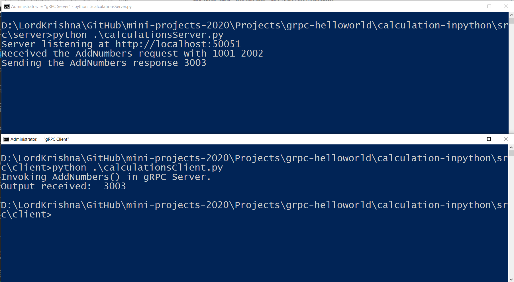
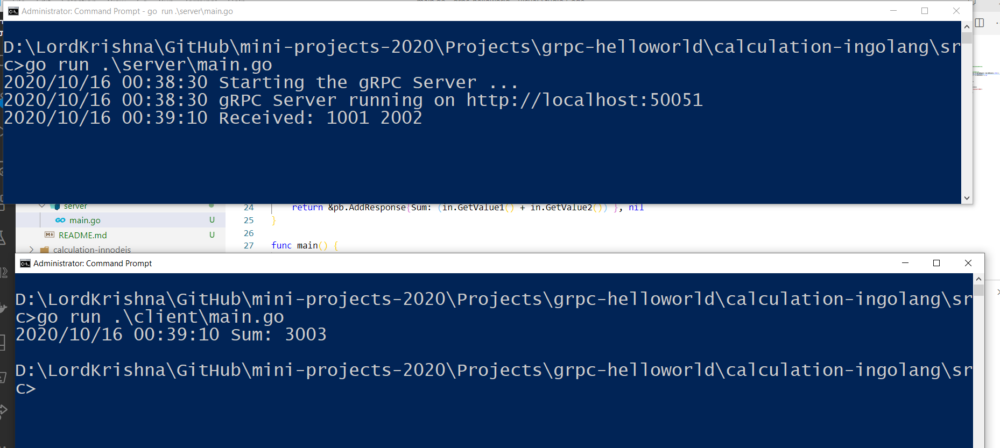

# Simple gRPC Samples in .Net Core, Node JS, and Python

## 1. Output of gRPC Server and Client in .Net Core, Node JS, Python

### 1.1. gRPC Server and Client in **.Net Core C#**


### 1.2. gRPC Server and Client in **Node JS**


### 1.3. gRPC Server and Client in **Python**



### 1.4. gRPC Server and Client in **GoLang**



## 2. Steps to execute gRPC Server and Client in .Net Core

### 2.1. To be done


## 3. Steps to execute gRPC Server and Client in Node JS

### 3.1. Packages to be installed

1. npm i google-protobuf
2. npm i grpc
3. npm i grpc-tools
4. npm i protoc-gen-grpc

### 3.2. To Generate the files using protoc

Execute the below mentioned command from the root folder example **D:/LordKrishna/GitHub/mini-projects-2020/Projects/grpc-helloworld/calculation-innodejs** where package.json file exists.

**We need to specify the absolute path**

```
protoc -I=D:/LordKrishna/GitHub/mini-projects-2020/Projects/grpc-helloworld/calculation-innodejs/src/protos D:/LordKrishna/GitHub/mini-projects-2020/Projects/grpc-helloworld/calculation-innodejs/src/protos/calculations.proto --js_out=import_style=commonjs,binary:D:/LordKrishna/GitHub/mini-projects-2020/Projects/grpc-helloworld/calculation-innodejs/src/protos/generated --grpc_out=D:/LordKrishna/GitHub/mini-projects-2020/Projects/grpc-helloworld/calculation-innodejs/src/protos/generated --plugin=protoc-gen-grpc=D:/LordKrishna/GitHub/learning_node_in_2020/calculation-grpcdemo/node_modules/.bin/grpc_tools_node_protoc_plugin.cmd
```


## 4. Steps to execute gRPC Server and Client in Python

### 4.1. Packages to be installed

1. python -m pip install --upgrade pip
2. python -m pip install grpcio
3. python -m pip install grpcio-tools

### 4.2. To Generate the files using protoc

**We need to specify the absolute path**

Execute the below mentioned command inside the **Protos** folder

```
python -m grpc_tools.protoc -I=D:\LordKrishna\GitHub\mini-projects-2020\Projects\grpc-helloworld\calculation-inpython\src\protos --python_out=D:\LordKrishna\GitHub\mini-projects-2020\Projects\grpc-helloworld\calculation-inpython\src\protos\generated --grpc_python_out=D:\LordKrishna\GitHub\mini-projects-2020\Projects\grpc-helloworld\calculation-inpython\src\protos\generated calculations.proto
```

*******************************************************************************************************************************

## Packages to be installed

1. npm i google-protobuf
2. npm i grpc
3. npm i grpc-tools
4. npm i protoc-gen-grpc


## To Generate the files using protoc

**We need to specify the absolute path**

protoc -I=D:/LordKrishna/GitHub/learning_node_in_2020/calculation-grpcdemo/src/protos D:/LordKrishna/GitHub/learning_node_in_2020/calculation-grpcdemo/src/protos/calculations.proto --js_out=import_style=commonjs,binary:D:/LordKrishna/GitHub/learning_node_in_2020/calculation-grpcdemo/src/protos --grpc_out=D:/LordKrishna/GitHub/learning_node_in_2020/calculation-grpcdemo/src/protos --plugin=protoc-gen-grpc=D:/LordKrishna/GitHub/learning_node_in_2020/calculation-grpcdemo/node_modules/.bin/grpc_tools_node_protoc_plugin.cmd

To get started, make sure to install the NPM dependencies:
`$ npm install`


protoc --plugin=protoc-gen-ts=D:/gRPC_Session11_26Sep2020/Source/college-gRPCweb/node_modules/.bin/protoc-gen-ts.cmd --js_out=import_style=commonjs,binary:D:/gRPC_Session11_26Sep2020/Source/college-gRPCweb --ts_out=service=grpc-web:D:/gRPC_Session11_26Sep2020/Source/college-gRPCweb src/app/proto/CollegeApi.proto"