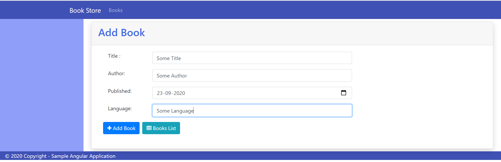
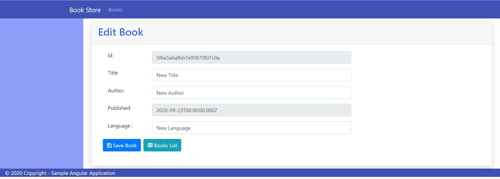

# This mini-project is made using MEAN stack

## Application Looks and Feel

### Angular 10 UI

'
'
'
'
'

### Web API

## Technologies Used

1. Node JS + Express Web API
2. Angular 10 UI
3. Mongo Db [Atlas](https://cloud.mongodb.com/)

## Tasks to complete before executing the application

1. To be done

## How to execute the project

1. To be done

## Angular UI 

1. To be done

## Web API

1. To be done
