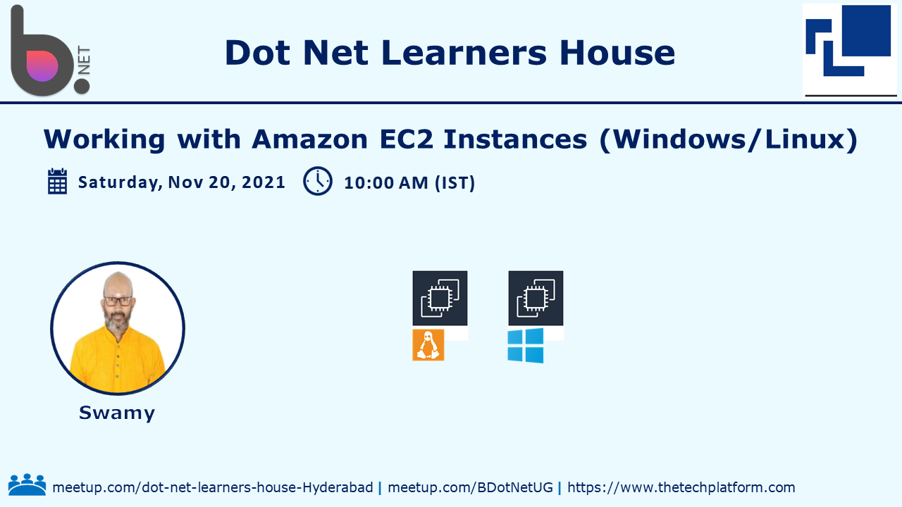
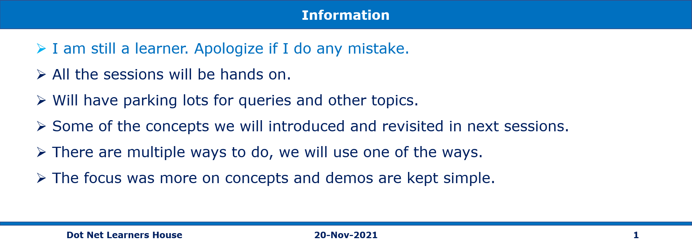

# Working with Amazon Elastic Compute Cloud (EC2) Instances (Windows/Linux) for .NET Devs

## Date Time: 20-Nov-2021 at 10:00 AM IST

## Event URL: [https://www.meetup.com/dot-net-learners-house-hyderabad/events/281685433](https://www.meetup.com/dot-net-learners-house-hyderabad/events/281685433)

## Youtube URL: To be added



---

## Application Architecture Diagram


---


## Information



## What are we doing today?

> 1. Introduction to Amazon EC2 - Discussion
> 1. Hands-On Deploying Ubuntu EC2
> 1. Hands-On Deploying Windows EC2
> 1. SUMMARY / RECAP / Q&A


---

## 1. Introduction to Amazon EC2 - Discussion
> 1. Amazon Machine Images (AMIs)
> 1. Instance types
> 1. Instance Purchasing Options
> 1. Tenancy
> 1. User Data
> 1. Storage Options
> 1. Security (Security Groups, Key Pairs, IAM Roles)

The VPC
Security Groups
Volumes
Tags

Temporary storage volumes are provided, which are called Instance Store Volumes.  Data stored in this gets deleted once the instance is terminated.

Persistent storage volumes are available and are referred to as EBS (Elastic Block Store) volumes.

### User Name:
`ec2-user`
`ubuntu`

## 2. Hands-On Deploying Linux EC2
> 1. Discussion & Demo

### Login using SSH in WSL2

```
ls -l
chmod 400 linuxvm1.pem
ssh -i "linuxvm1.pem" ec2-user@ec2-3-82-191-107.compute-1.amazonaws.com
```


### Login using Windows SSH

```
icacls.exe linuxvm2.pem /reset
icacls.exe linuxvm2.pem /grant:r "PK.Viswanatha-Swamy:r"
icacls.exe linuxvm2.pem /inheritance:r
```

Reference: [https://gist.github.com/jaskiratr/cfacb332bfdff2f63f535db7efb6df93](https://gist.github.com/jaskiratr/cfacb332bfdff2f63f535db7efb6df93)

### Connect using Putty in Windows


## 2. Hands-On Deploying Ubuntu EC2
> 1. Discussion & Demo

##### DEMO 1
sudo apt update && sudo apt install -y lamp-server^
logout

##### DEMO 2
sudo apt-get -y update
sudo apt-get -y install nginx
logout

### EC2 Instance Connect (browser-based SSH connection)

## 3. Hands-On Deploying Windows EC2

> 1. Reboot the machine to show data loss

```
DISM /online /enable-feature /featureName:IIS-DefaultDocument /All

PS > Install-WindowsFeature -name Web-Server -IncludeManagementTools
```

### Web App Console


## 4. SUMMARY / RECAP / Q&A

---

> 1. SUMMARY / RECAP / Q&A
> 2. Any open queries, I will get back through meetup chat/twitter.

---

## What is Next? 

**URL:** [https://www.meetup.com/dot-net-learners-house-hyderabad/events/281836958](https://www.meetup.com/dot-net-learners-house-hyderabad/events/281836958)
**Date:** 18-Dec-2021 at 10:00 AM IST

> 1. Deploying .NET Apps into Amazon EC2 Instances (Windows/Linux)
