# Deploying .NET 6 Apps into Amazon EC2 (Ubuntu/Windows)

## Date Time: 18-Dec-2021 at 09:00 AM IST

## Event URL: [https://www.meetup.com/dot-net-learners-house-hyderabad/events/281836958](https://www.meetup.com/dot-net-learners-house-hyderabad/events/281836958)

## Youtube URL: [https://www.youtube.com/watch?v=FAgrCzShssY](https://www.youtube.com/watch?v=FAgrCzShssY)

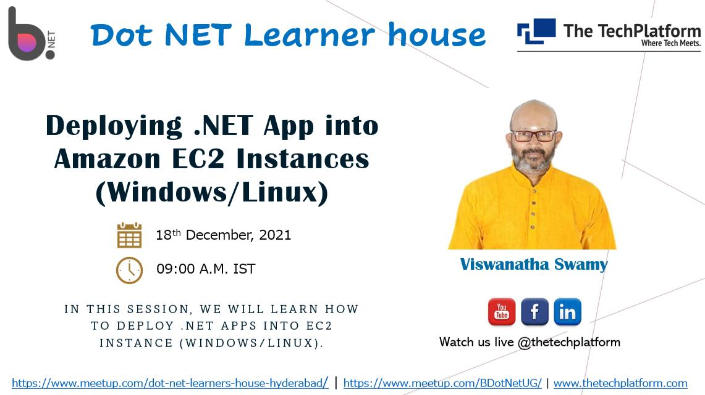

---

## Application Architecture Diagram


---

## Information

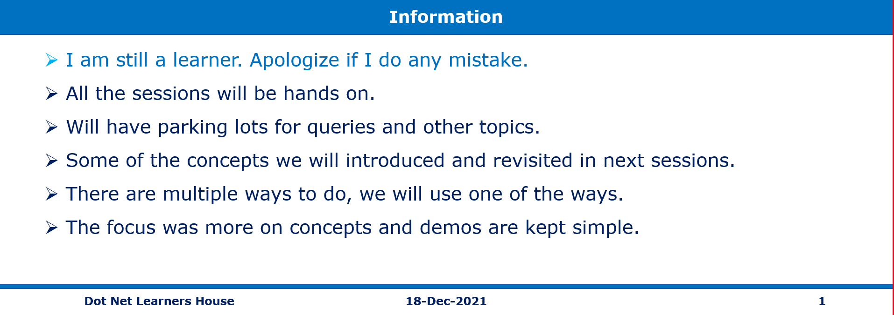

## What are we doing today?

> 1. Deploying .NET 6 Web API into Amazon EC2 (Ubuntu)
> 1. Deploying .NET 6 Web App into Amazon EC2 (Windows)
> 1. SUMMARY / RECAP / Q&A


---

## 1. Deploying .NET 6 Web API into Amazon EC2 (Ubuntu)

**Note:**

> 1. Port 80 is already open on EC2 instance

### 1.1. Installing Nginx on Ubuntu EC2

> 1. Discussion & Demo

```
sudo apt-get -y update
sudo apt-get -y install nginx
curl -I http://localhost
```

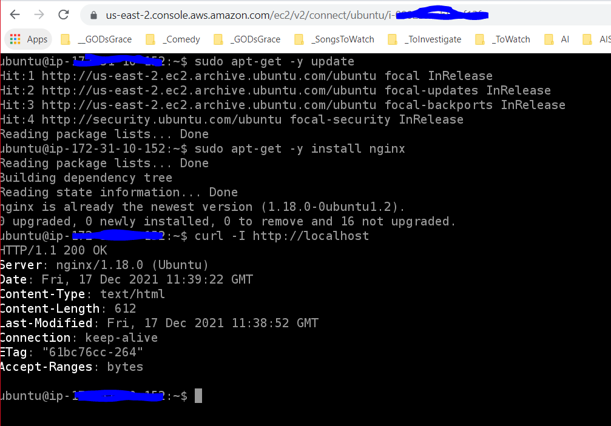

### 1.2. Installing .NET 6 on Ubuntu EC2

> 1. Discussion & Demo

Reference: https://docs.microsoft.com/en-gb/dotnet/core/install/linux-ubuntu#2004-

```
wget https://packages.microsoft.com/config/ubuntu/20.04/packages-microsoft-prod.deb -O packages-microsoft-prod.deb
sudo dpkg -i packages-microsoft-prod.deb
rm packages-microsoft-prod.deb
```

```
sudo apt-get update
sudo apt-get install -y apt-transport-https
sudo apt-get update
sudo apt-get install -y dotnet-sdk-6.0
```

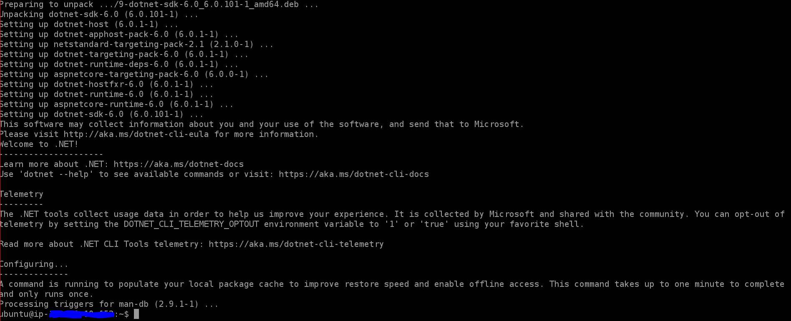

### 1.3. Verifying the .NET 6 Web API on the local box

> 1. Discussion & Demo

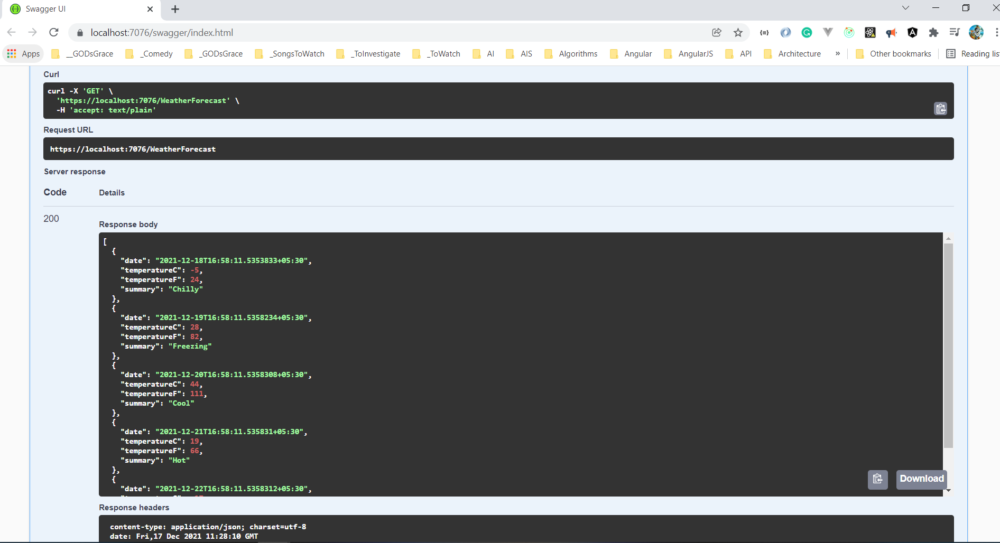

### 1.4. Publish and push the binaries into the Ubuntu EC2

> 1. Publish the Web API to local folder
> 1. Push the Web API to the Ubuntu EC2

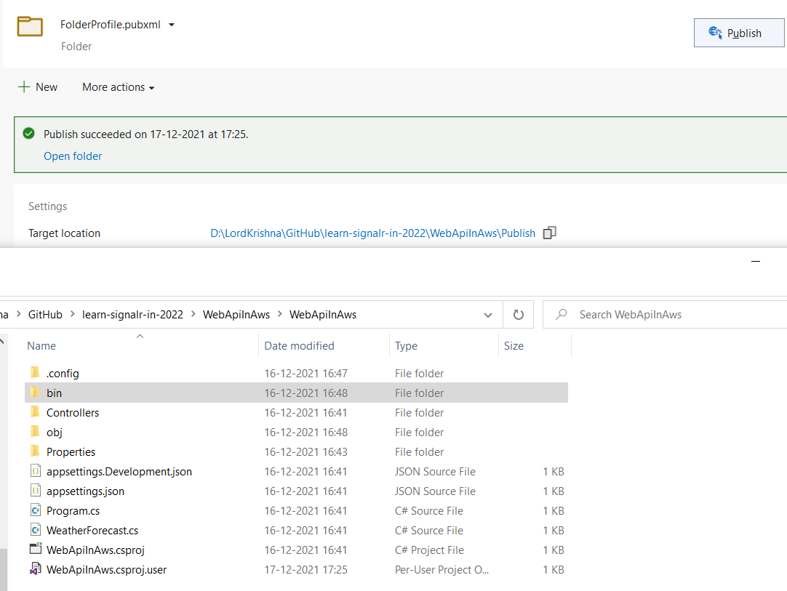

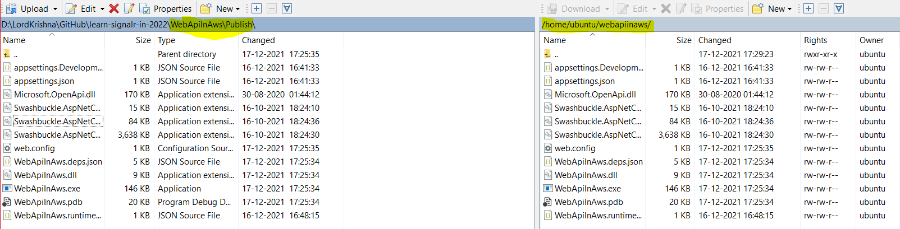

### 1.5. Verify the .NET 6 Web API inside Ubuntu EC2

> 1. Discussion & Demo
> 1. Execute `dotnet --list-sdks`
> 1. Execute `dotnet WebApiInAws.dll`
> 1. Open another instance of the terminal and execute `curl -I http://localhost:5000`
> 1. netstat -tnlp


### 1.6. Accessing the .NET 6 Web API outside Ubuntu EC2

> 1. Update appsettings.json file with the `"url": "http://0.0.0.0:5000;https://0.0.0.0:5001"`
> 1. netstat -tnlp

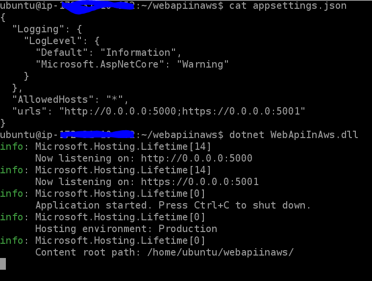

> 1. Open the Web Browser and navigate to `http://PublicIP:5000`

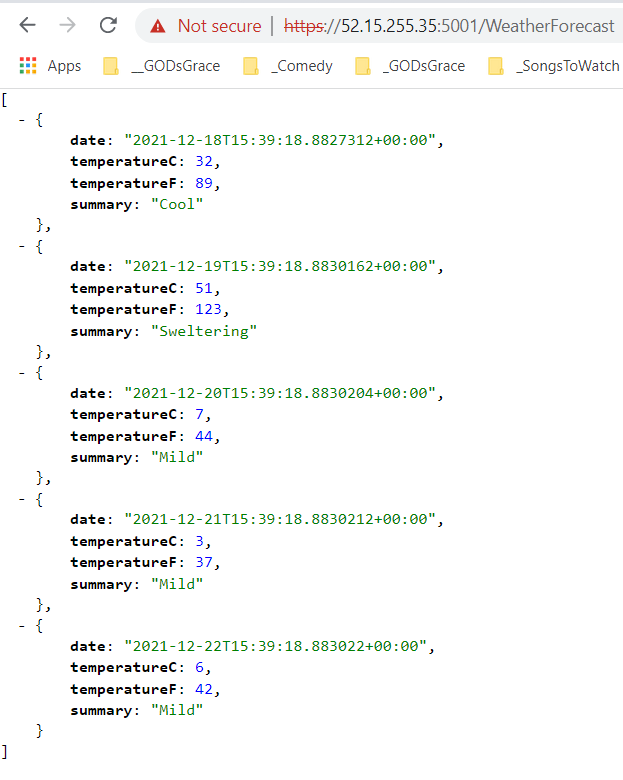

### 1.7. Run .NET 6 Web API as a service on Ubuntu EC2

> 1. Rename the `urls` to `urlx` inside appsettings.json file
> 1. Create a service file for our Web API

```
sudo nano /etc/systemd/system/webapiinaws.service
```

**Note:**

> 1. The service file is created in the `/etc/systemd/system` folder
> 1. Update the permissions of the service file to `0644`
> 1. Update the webapiinaws.service file with the content given below

```
[Unit]
Description=First .NET 6 Core Web API on Ubuntu

[Service]
WorkingDirectory=/home/ubuntu/webapiinaws
ExecStart=/usr/bin/dotnet /home/ubuntu/webapiinaws/WebApiInAws.dll
Restart=always
RestartSec=10 # Restart service after 10 seconds if dotnet service crashes
SyslogIdentifier=offershare-web-app
Environment=ASPNETCORE_ENVIRONMENT=Production

[Install]
WantedBy=multi-user.target
```

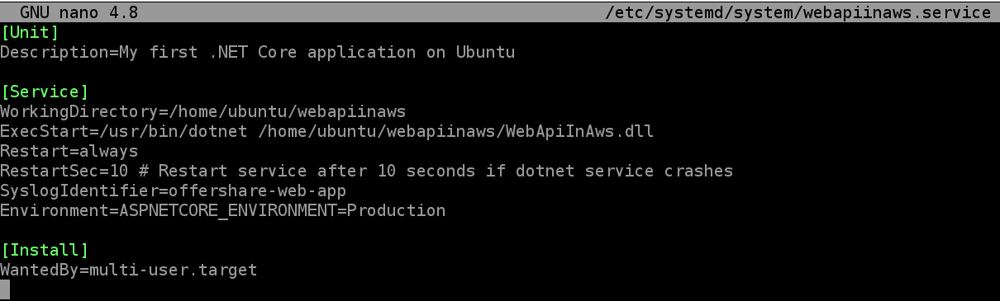

> 1. Enable the service and run it

```
systemctl daemon-reload
sudo systemctl enable webapiinaws.service
sudo systemctl start webapiinaws.service
sudo systemctl status webapiinaws.service
```

```
sudo systemctl daemon-reload
sudo systemctl stop webapiinaws.service
sudo systemctl disable webapiinaws.service
```

### 1.8. Configure Reverse proxy inside Nginx to route the traffic to the .NET 6 Web API

> 1. Discussion & Demo
> 1. Navigate to `http://public-ip-address` in the browser
> 1. We should be able to see the default page of the Nginx
> 1. Update `/etc/nginx/sites-available/default` file with the content given below
> 1. `sudo nano /etc/nginx/sites-available/default`

```
server {
    listen 80;
    
    location / {
        proxy_pass http://localhost:5000;
        proxy_http_version 1.1;
        proxy_set_header Upgrade $http_upgrade;
        proxy_set_header Connection keep-alive;
        proxy_set_header Host $host;
        proxy_cache_bypass $http_upgrade;
        proxy_set_header X-Forwarded-For $proxy_add_x_forwarded_for;
        proxy_set_header X-Forwarded-Proto $scheme;
    }
}
```

```
sudo service nginx start
sudo service nginx restart

sudo systemctl status nginx.service

sudo journalctl -xe
```

---

## 2. Deploying .NET 6 Web App into Amazon EC2 (Windows)

> 1. Discussion & Demo

### EC2 Instance Connect (browser-based SSH connection)

> 1. Demo

### Login Into Linux VM Using Browser


### Login using SSH in WSL2

> 1. Demo

```
ls -l
chmod 400 linuxvm1.pem
ssh -i "linuxvm1.pem" ec2-user@ec2-3-82-191-107.compute-1.amazonaws.com
```

### Setting `.pem` Key File Permission


### Login Into Linux VM Using SSH in WSL2

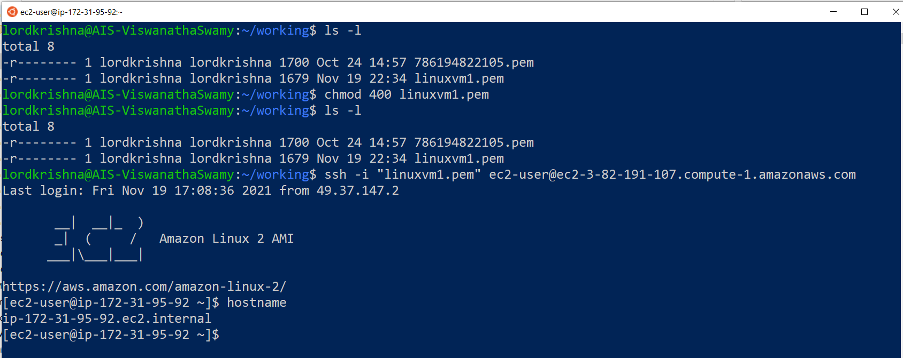

### DEMO 1 LAMP/Nginx Server

```
sudo apt update && sudo apt install -y lamp-server^
curl -I http://localhost
```

### Accessing the Apache default page On Ubuntu VM


## 3. SUMMARY / RECAP / Q&A

---

> 1. SUMMARY / RECAP / Q&A
> 2. Any open queries, I will get back through meetup chat/twitter.

---

## What is Next?

**URL:** [https://www.meetup.com/dot-net-learners-house-hyderabad/events/ToBeDone](https://www.meetup.com/dot-net-learners-house-hyderabad/events/ToBeDone)

**Date:** `15-Jan-2022` at `09:00 AM IST`

> 1. Introduction with Amazon S3 Bucket
> 1. Working with S3 using .NET
> 1. Deploying static websites on Amazon S3
> 1. VPC, Subnets
> 1. Availability Zones (AZs)
> 1. Regions
> 1. Edge Locations
> 1. Regional Edge Caches
> 1. Reboot the machine to show data loss
