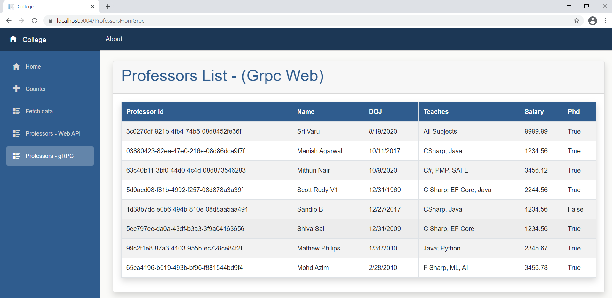

# Speaking Event - mobconf - 09-Jan-2021 - gRPC Web, Blazor WASM using .NET 5


## Pre-Requisites

### Software/Tools
> 1. OS: win32 x64
> 1. .NET 5
> 1. VS 2019 Community Edition
> 1. Visual Studio Code
> 1. Postman
> 1. SQL Server 2016 and above 
> 1. Azure Data Studio

### Knowledge
> 1. Basic C#
> 1. Basic EF Core
> 1. Basic knowledge of async/await

### Assumptions
> 1. Database is created and .sql scrips are ran.
> 1. Please refer to the ./Scripts Folder


## Technology Stack

> 1. .NET 5 SDK
> 1. Web API
> 1. gRPC
> 1. Blazor WASM


## Information


## How to Build and Execute the solution

## What we already have
> 1. College.Core.csproj
> 1. College.Dal
> 1. College.Bll
> 1. College.WebAPI

## Quickly verify the output in Postman
Demo


## Create New gRPC Web Project
> 1. Reference Auto Mapper and gRPC Web Nuget packages.
> 1. Use **User Secrets** instead on appsettings.json.
> 1. Add college.Proto file. Please refer **StarterFiles** folder.
> 1. Create CollegeService.cs and implement the RPC methods. Please refer **StarterFiles** folder.
> 1. Modify Startup.cs to allow CORS.
> 1. Also modify Startup.cs ConfigureServices(), and Configure() methods.
```
    <PackageReference Include="AutoMapper.Extensions.Microsoft.DependencyInjection" Version="8.1.0" />
    <PackageReference Include="Grpc.AspNetCore.Web" Version="2.34.0" />
```

```
    services.AddCors(o => o.AddPolicy(_policyName, builder =>
    {
        builder.AllowAnyOrigin()
                .AllowAnyMethod()
                .AllowAnyHeader();
        }));

        services.AddAutoMapper(typeof(Startup));

        // Adding EF Core
        var connectionString = Configuration[Constants.DataStore.SqlConnectionString];
        services.AddDbContext<CollegeDbContext>(o => o.UseSqlServer(connectionString));

        // Application Services
        services.AddScoped<IProfessorsBll, ProfessorsBll>();
        services.AddScoped<IProfessorsDal, ProfessorsDal>();
```

```
    // Must be added between UseRouting and UseEndpoints
    app.UseGrpcWeb();

    app.UseCors(_policyName);
    
    endpoints.MapGrpcService<CollegeService>().EnableGrpcWeb().RequireCors(_policyName);
```

## Verify the gRPC using Console, and Windows Form Client.
> 1. CollegeGrpc.ConsoleClient.csproj
> 1. CollegeGrpc.WindowsFormClient.csproj


## Create a New Blazor WASM
> 1. Demo

## Modify Blazor UI
> 1. MainLayout.razor.css
> 1. MainLayout.razor
> 1. app.css

## Modify to add two more menu items
> 1. NavMenu.razor

## REST API Integration
> 1. Create ProfessorsFromWebAPI.razor, and ProfessorsFromWebAPI.cs.


## gRPC Web Integration
> 1. Reference the college.proto inside the Blazor Project.
> 1. Modify the .csproj to refer the below packages.
> 1. Also reference College.Core.
> 1. Add appsettings.json file
> 1. Add "GrpcChannel" Dependencies inside Program.cs.
> 1. Create ProfessorsFromGrpc.razor, and ProfessorsFromGrpc.cs files inside **Pages** folder.
> 1. Modify ProfessorsFromGrpc.razor, and ProfessorsFromGrpc.cs files. Please refer **StarterFiles** folder.
> 1. Execute and verify the UI receiving the data from gRPC Web.
```
    <PackageReference Include="Google.Protobuf" Version="3.14.0" />
    <PackageReference Include="Grpc.Net.Client" Version="2.34.0" />
    <PackageReference Include="Grpc.Net.Client.Web" Version="2.34.0" />
    <PackageReference Include="Grpc.Tools" Version="2.34.0">
      <PrivateAssets>all</PrivateAssets>
      <IncludeAssets>runtime; build; native; contentfiles; analyzers; buildtransitive</IncludeAssets>
    </PackageReference>
```


## Benchmark Web API VS gRPC


