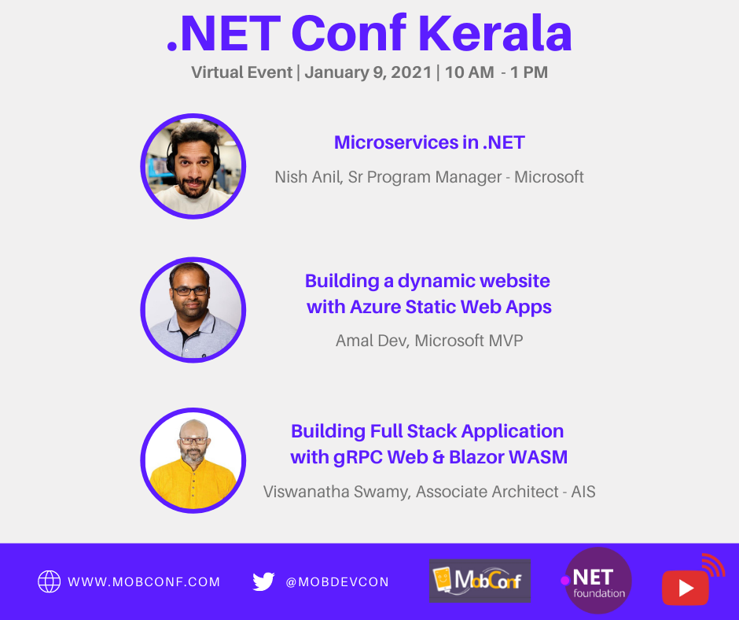
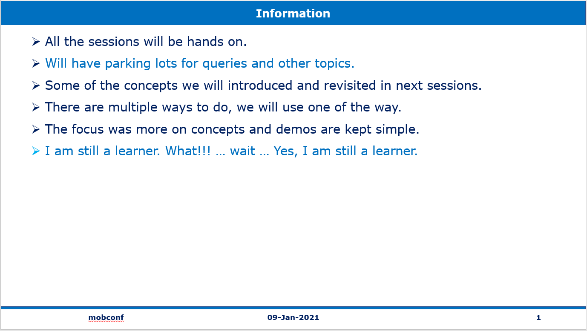

# Speaking Event - mobconf - 09-Jan-2021 - gRPC Web, Blazor WASM using .NET 5

## Pre-Requisites

### Software/Tools
> 1. OS: win32 x64
> 1. .NET 5
> 1. VS 2019 Community Edition
> 1. Visual Studio Code
> 1. Postman
> 1. SQL Server 2016 and above 

### Knowledge
> 1. Basic C#
> 1. Basic EF Core
> 1. Basic knowledge of async/await

### Assumptions
> 1. Database is created and .sql scrips are ran.
> 1. Please refer to the ./Scripts Folder

## Technology Stack

> 1. .NET 5 SDK
> 1. Web API
> 1. gRPC
> 1. Blazor WASM

## Information

